# SPR — Sprint Planning & Release · Lupa (Mini-Gadget de Siglas)

> Plano de execução, ondas de paralelização e release.
> Versão 1.0 — 2026-09-16 · Owner: Edinho Siqueira
> Base normativa: `docs/BRIEFING.md` (escopo §6.1/§6.2, métricas §7) e `docs/SPEC.md`
> (arquitetura §2, modelo de dados §3, busca §4, UI §5, IPC §6, RNFs §8, estrutura §9).
> Aceite: `docs/VF.md`.

---

## 1. Estratégia de entrega

### 1.1 Por que ondas e não sprints

A execução deste projeto não é feita por um time humano com capacidade fixa por
semana, e sim por **agentes de IA rodando em paralelo**. Isso muda três coisas:

1. **A unidade de planejamento é a onda, não a semana.** Uma onda é um conjunto de
   tarefas que não dependem umas das outras e podem ser executadas simultaneamente
   por agentes distintos. A onda termina quando *todas* as suas tarefas passam no
   critério de saída.
2. **O gargalo é a dependência, não a mão de obra.** Adicionar agentes a uma onda
   não a encurta; encurtar o caminho crítico sim. Por isso o backlog declara
   dependências reais por ID, não "prioridade".
3. **O contrato vale mais que a coordenação.** Agentes paralelos não conversam
   durante a execução. O que os mantém compatíveis é um contrato de tipos escrito
   **antes** de qualquer implementação e **congelado** depois (ver §9.1).

A duração de cada onda é o tempo da sua tarefa mais longa (as demais rodam em
paralelo e terminam antes). Estimativas em horas de execução de agente estão na
coluna *Est.* do backlog — servem para dimensionar o caminho crítico, não para
prometer data de calendário.

### 1.2 Caminho crítico

O caminho crítico da v1.0 é:

```
T-02 (contrato de tipos + Zod)
  → T-08 (repository.ts com escrita atômica)
    → T-20 (ipc/handlers.ts)
      → T-27 (tela Repertório com CRUD)
        → T-33 (suíte E2E)
          → T-39 (electron-builder final)
            → T-40 (build dos artefatos)
              → T-42 (verificação contra o VF)
                → T-43 (release notes + tag v1.0.0)
```

**≈ 69 h de execução encadeada**, dentro de um cronograma gatilhado por ondas de
**≈ 74 h** de relógio (soma das tarefas mais longas de cada onda). O total de
esforço é de **264 h** — ou seja, o paralelismo comprime ~3,6× o trabalho.

Tudo que **não** está nesse caminho tem folga e nunca deve bloquear: seed,
ícones, importer/exporter, tema, README, benchmark. Se uma dessas atrasar, a onda
seguinte começa mesmo assim (ver política de exceção em §4).

### 1.3 Política: vertical slice funcional primeiro

Regra inegociável: **o app tem que abrir, buscar e mostrar resultado antes de
qualquer refinamento.** Nenhuma tarefa de polimento, tema, acessibilidade,
importação de planilha ou instalador entra antes do marco M2.

Consequências práticas do slice vertical:

- A **Onda 1** entrega um app que abre uma janela (esqueleto andando), não só
  arquivos de configuração. Se `npm run dev` não abrir janela, a onda não fechou.
- A **Onda 2** constrói os blocos do núcleo já testáveis isoladamente (store,
  busca, janelas, componentes), mas ainda desconectados.
- A **Onda 3** é a costura: atalho global → painel focado → digitar `ppap` →
  card com abas Inglês/Português/Aplicação. **Esse é o coração do produto e ele
  existe no fim da terceira onda, com ~57% do esforço total ainda por fazer.**
- Só depois vêm CRUD (Onda 4), RNFs e polimento (Onda 5) e instalador (Onda 6).

Corolário anti-desperdício: `ResultCard` e `SearchPanel` são construídos na Onda 2
contra o contrato de tipos e **dados mockados**, não contra o backend real. Assim a
UI não espera o store e o store não espera a UI.

### 1.4 Papéis dos agentes

| Sigla | Papel | Responsabilidade |
|---|---|---|
| **ARQ** | Arquiteto/Core | Scaffold, contrato compartilhado, serviço de busca, `main.ts`, performance |
| **DAT** | Dados | Store, normalização, seed, importer/exporter, histórico/favoritos |
| **MAI** | Main-Process | Janelas, bandeja, atalho global, preload, IPC, autostart, hardening |
| **UI** | Renderer/UI | Componentes React, telas, tema, acessibilidade, polimento |
| **QA** | Qualidade | Infra de testes, unitários, E2E, benchmark, smoke test, aceite VF |
| **BLD** | Build/Release | Ícones/assets, electron-builder, artefatos, hashes |
| **DOC** | Documentação | README de uso, release notes |

Cada papel pode ser **instanciado múltiplas vezes** na mesma onda (ex.: `UI-1`,
`UI-2`, `UI-3` na Onda 2). A coluna *Agente* do backlog indica o papel; a
alocação de instâncias está no cabeçalho de cada onda em §4.

---

## 2. Backlog completo

Legenda MoSCoW: **M** = Must (v1.0 não sai sem), **S** = Should (sai degradado se
faltar), **W** = Won't na v1.0 (vai para §10). Não há itens *Could* na v1.0: todo
o escopo §6.1 do briefing é M ou S.

### 2.1 Onda 1 — Fundação e contrato

| ID | Título | Descrição | Entregável | Depende de | Onda | Est. | MoSCoW | Critério de pronto |
|---|---|---|---|---|---|---|---|---|
| **T-01** | Scaffold Electron + Vite + TS + React | Cria o repositório conforme SPEC §9 com Electron 32, Vite 5, TypeScript 5 strict, React 18 e uma `BrowserWindow` mínima que abre em dev e em build. | `package.json`, `tsconfig.json` (strict), `vite.config.ts`, `src/main/main.ts` (mínimo), `src/preload/preload.ts` (vazio), `src/renderer/App.tsx` (placeholder), `.gitignore`, `.editorconfig` | — | 1 | 5 h | M | `npm i && npm run dev` abre janela; `npm run build` gera bundle; `tsc --noEmit` limpo com `strict: true`, `noUncheckedIndexedAccess` |
| **T-02** | Contrato compartilhado (tipos + Zod) | Escreve os schemas Zod de SPEC §3.2 e §6 como **fonte da verdade** e deriva os tipos TS via `z.infer`. Este é o artefato congelado da §9.1. | `src/shared/schema.ts` (`CategoriaSchema`, `SentidoSchema`, `SiglaSchema`, `RepertorioSchema`, `ConfigSchema`, `FiltroSchema`, `ResultadoBuscaSchema`, `RelatorioImportSchema`), `src/shared/types.ts` (re-export de `z.infer` + `interface LupaAPI`) | — | 1 | 5 h | M | `tsc --noEmit` limpo; todo tipo de SPEC §3.2/§6 representado; nenhum `any`; `types.ts` não declara tipo estrutural próprio, só deriva de `schema.ts` |
| **T-03** | Normalização de sigla | Implementa SPEC §4.1: trim → uppercase → NFD sem acento → remove `. - _ /` → colapsa espaços. Função pura, sem I/O. | `src/shared/normalize.ts`, `tests/unit/normalize.test.ts` | — | 1 | 3 h | M | `" p.h.e.s "`→`PHES`, `"ação"`→`ACAO`, `"pp-ap"`→`PPAP`, `"a/b"`→`AB`; ≥ 20 casos de teste verdes |
| **T-04** | Repertório semente (≥ 100 siglas) | Monta o seed com siglas reais das 4 categorias (automotivo, ti, corporativo, generico), com EN, PT, contexto, exemplo, área, processo e referência preenchidos. | `data/siglas.seed.json` | — | 1 | 8 h | M | ≥ 100 siglas (meta M5 do briefing); valida contra `RepertorioSchema`; ≥ 20 siglas por categoria; ≥ 3 siglas com 2+ sentidos (desambiguação); zero sigla sem `en`, `pt` e `aplicacao.contexto` |
| **T-05** | Ícones e assets | Produz o ícone da lupa em todas as densidades necessárias para bandeja, janela, instalador e UI. | `build/icon.ico` (256/128/64/48/32/16), `build/icon.png` (512), `build/tray.png` (16/32 @1x@2x), `src/renderer/assets/lupa.svg` | — | 1 | 3 h | M | `.ico` multi-resolução válido; tray legível em tema claro e escuro do Windows; SVG com `currentColor` |
| **T-06** | Infra de testes | Configura Vitest (unit) e Playwright (E2E Electron) com scripts npm e estrutura de pastas, rodando vazio e verde. | `vitest.config.ts`, `playwright.config.ts`, `tests/unit/.gitkeep`, `tests/e2e/fixtures.ts`, scripts `test`, `test:unit`, `test:e2e` | — | 1 | 4 h | M | `npm run test:unit` e `npm run test:e2e` executam e retornam 0 sem testes; fixture E2E consegue lançar o Electron empacotado em modo dev |
| **T-07** | Tokens de tema e CSS base | Define variáveis de design (cores claro/escuro, espaçamento, raio, tipografia, z-index) e o reset, base do tema de SPEC §5.5. | `src/renderer/styles/tokens.css`, `src/renderer/styles/base.css`, `src/renderer/styles/theme.ts` | — | 1 | 4 h | M | Tokens cobrem claro e escuro via `prefers-color-scheme` e classe `.tema-claro/.tema-escuro`; nenhuma cor hardcoded fora de `tokens.css` |

**Subtotal Onda 1: 7 tarefas · 32 h · duração ≈ 8 h**

### 2.2 Onda 2 — Blocos do núcleo (desconectados)

| ID | Título | Descrição | Entregável | Depende de | Onda | Est. | MoSCoW | Critério de pronto |
|---|---|---|---|---|---|---|---|---|
| **T-08** | Store: repositório com escrita atômica e backup | CRUD do repertório em `%APPDATA%/Lupa/repertorio.json` com escrita `.tmp` + `rename` e rotação de 5 backups (SPEC §3.1), respeitando as regras de integridade §3.3. | `src/main/store/repository.ts`, `src/main/store/atomic.ts`, `tests/unit/repository.test.ts` | T-02 | 2 | 8 h | M | Sigla é chave única normalizada; excluir último sentido remove a sigla; kill durante a escrita nunca deixa JSON parcial; 6ª escrita descarta o backup mais antigo; leitura de arquivo corrompido cai para o backup mais recente válido |
| **T-09** | Store: configurações | Preferências de SPEC §5.5 com `electron-store`, defaults e migração de chave desconhecida. | `src/main/store/settings.ts`, `tests/unit/settings.test.ts` | T-02 | 2 | 4 h | M | `obterConfig()` devolve defaults num perfil limpo (atalho `Ctrl+Alt+L`, tema `sistema`, opacidade 0,55, aba padrão `en`); patch parcial não apaga chaves irmãs; valida com `ConfigSchema` na leitura |
| **T-10** | Serviço de busca em cascata | Implementa as 5 estratégias de SPEC §4.2 (exato → prefixo → fuzzy Fuse threshold 0,3 → full-text em `en`/`pt`/`tags` → vazio) e a ordenação de desambiguação §4.3. | `src/main/services/search.ts`, `tests/unit/search.test.ts` | T-02, T-03 | 2 | 10 h | M | Cada estratégia tem teste dedicado; `ResultadoBusca` informa qual estratégia venceu; ordenação favorito → acessos → categoria preferida → alfabética; índice Fuse construído uma vez e invalidado em escrita |
| **T-11** | Gerenciador de janelas | `LupaWindow` 48×48 frameless/transparente/`alwaysOnTop: 'screen-saver'`/fora da taskbar e `PanelWindow` 380×520 ancorado à lupa, com posição persistida (SPEC §5.1/§5.2). | `src/main/window-manager.ts` | T-01 | 2 | 7 h | M | Lupa fica sobre janelas maximizadas e não aparece na Alt+Tab; arrastar salva posição e ela é restaurada no próximo boot; painel abre ancorado e não sai da área visível em multi-monitor |
| **T-12** | Preload e contextBridge | Expõe `window.lupa` tipado conforme `LupaAPI` (SPEC §6) via `contextBridge`, com `nodeIntegration: false`, `contextIsolation: true`, `sandbox: true`. | `src/preload/preload.ts`, `src/shared/ipc-channels.ts` | T-02 | 2 | 4 h | M | Renderer não acessa `require`/`fs`/`process`; todos os 14 métodos de `LupaAPI` presentes (stub `invoke` na Onda 2); nomes de canal centralizados em `ipc-channels.ts` |
| **T-13** | Bandeja do sistema | Ícone de bandeja com menu de contexto: Abrir busca · Repertório · Configurações · Sair. | `src/main/tray.ts` | T-01, T-05 | 2 | 4 h | M | Ícone visível em tema claro e escuro; clique simples abre o painel; "Sair" encerra o processo e libera o atalho global |
| **T-14** | Atalho global | Registro/liberação de `globalShortcut` com fallback quando o atalho já está tomado por outro app. | `src/main/shortcuts.ts` | T-01 | 2 | 4 h | M | `Ctrl+Alt+L` registra por padrão; conflito devolve erro tratável em vez de falha silenciosa; `unregisterAll` no `will-quit` |
| **T-15** | Componente LupaButton | Ícone flutuante com estados idle (opacidade 0,55 após 5 s) / hover (1,0 + escala 1,08) / active, região de drag `-webkit-app-region`. | `src/renderer/components/LupaButton.tsx`, `LupaButton.module.css` | T-07 | 2 | 5 h | M | Transição de opacidade suave; área de drag não engole o clique; botão direito emite evento de menu de contexto |
| **T-16** | Componente SearchPanel | Input com foco automático, busca *as-you-type* com debounce de 120 ms e navegação por teclado (`Esc` fecha, `Enter` seleciona o 1º, `↑/↓` navega) — SPEC §5.2. | `src/renderer/components/SearchPanel.tsx`, `SearchPanel.module.css` | T-02, T-07 | 2 | 7 h | M | Debounce medido em 120 ms ±10; foco no input ao montar; teclas cobertas por teste de componente; lista de resultados com `aria-activedescendant` |
| **T-17** | Componente ResultCard | Card de SPEC §5.3: abas Inglês · Português · Aplicação, sub-abas Contexto · Onde aparece, botão copiar `[⧉]`, favoritar `[★]`, editar `[✎]`, badge de categoria. | `src/renderer/components/ResultCard.tsx`, `ResultCard.module.css`, `src/renderer/components/Tabs.tsx` | T-02, T-07 | 2 | 9 h | M | Aba padrão vem da config; `[⧉]` copia o texto da aba **ativa**; sub-abas só existem dentro de Aplicação; campos opcionais ausentes não deixam rótulo órfão; múltiplos sentidos empilham |
| **T-18** | Empacotamento inicial (smoke) | Config mínima do electron-builder rodando cedo para não descobrir problema de empacotamento na última onda. | `electron-builder.yml` (v0), script `npm run dist` | T-01, T-05 | 2 | 5 h | S | Gera um `.exe` portable x64 que abre a janela do esqueleto; falha de empacotamento aparece na Onda 2, não na Onda 6 |

**Subtotal Onda 2: 11 tarefas · 67 h · duração ≈ 10 h**

### 2.3 Onda 3 — Vertical slice: busca ponta a ponta

| ID | Título | Descrição | Entregável | Depende de | Onda | Est. | MoSCoW | Critério de pronto |
|---|---|---|---|---|---|---|---|---|
| **T-19** | Seed no 1º boot | Detecta ausência de `repertorio.json` e popula a partir de `data/siglas.seed.json`, validando antes de gravar. | `src/main/store/seed.ts`, `tests/unit/seed.test.ts` | T-04, T-08 | 3 | 4 h | M | Perfil limpo → ≥ 100 siglas disponíveis na 1ª busca; perfil existente nunca é sobrescrito; seed inválido aborta sem corromper nada |
| **T-20** | IPC tipado com validação Zod (leitura) | Handlers de `buscar`, `obter`, `listar`, `historico`, `obterConfig`, `abrirPainel`, `fecharPainel`, `copiar`, cada um validando entrada com Zod antes de tocar no store (SPEC §6). | `src/main/ipc/handlers.ts`, `src/main/ipc/validate.ts`, `tests/unit/handlers.test.ts` | T-08, T-09, T-10, T-12 | 3 | 9 h | M | Payload inválido devolve erro tipado e **não** chega ao store; nenhum handler lança exceção não tratada; canal desconhecido é rejeitado; cobertura de teste ≥ 90% no arquivo |
| **T-21** | Processo principal e ciclo de vida | `main.ts` costurando janelas, bandeja e atalho, com single-instance lock e comportamento de fechar/restaurar. | `src/main/main.ts` | T-11, T-13, T-14 | 3 | 6 h | M | 2ª instância foca a existente e sai; fechar o painel não mata o app; "Sair" na bandeja encerra tudo; boot a frio medido e registrado (alvo RNF3 < 3 s) |
| **T-22** | App shell e fluxo de busca | `App.tsx` com roteamento por janela (lupa / painel / repertório / configurações) e o fluxo real: atalho → painel focado → digita → `window.lupa.buscar` → `ResultCard`. | `src/renderer/App.tsx`, `src/renderer/routes.tsx`, `src/renderer/hooks/useBusca.ts` | T-12, T-15, T-16, T-17 | 3 | 7 h | M | **Slice vertical fechado**: `Ctrl+Alt+L` → digitar `p.h.e.s` → card correto na tela; estado de carregando, vazio e erro tratados; CTA "Cadastrar «XYZ»" aparece no caso 5 da cascata |
| **T-23** | Histórico e favoritos | Persistência das últimas consultas e alternância de favorito, com exibição no painel quando o input está vazio. | `src/main/store/historico.ts`, `src/renderer/components/Historico.tsx` | T-08, T-09 | 3 | 5 h | M | Últimas 20 consultas persistem entre reinícios; favoritar reordena o resultado conforme SPEC §4.3; limpar histórico disponível nas Configurações |
| **T-24** | Importador JSON/CSV/XLSX | Lê os 10 campos de SPEC §7, valida linha a linha e devolve `RelatorioImport`, nos modos `merge` (padrão) e `substituir` (com backup antes). | `src/main/services/importer.ts`, `tests/unit/importer.test.ts`, `tests/fixtures/import-*.{json,csv,xlsx}` | T-02, T-08 | 3 | 8 h | M | Linha inválida entra em `erros[]` com número da linha e motivo, sem abortar o lote; `merge` não perde sentido existente; `substituir` cria backup antes; CSV com BOM e `;` também é lido |
| **T-25** | Exportador JSON/CSV/XLSX | Gera os três formatos, uma linha por sentido, sempre UTF-8 com BOM. | `src/main/services/exporter.ts`, `tests/unit/exporter.test.ts` | T-02, T-08 | 3 | 6 h | M | Round-trip export→import preserva 100% dos campos; XLSX abre no Excel PT-BR sem quebrar acento; cabeçalho na ordem exata de SPEC §7 |
| **T-26** | Testes unitários do núcleo | Consolida e amplia a suíte sobre normalização, cascata de busca, integridade e atomicidade do store. | `tests/unit/*.test.ts`, relatório de cobertura | T-03, T-08, T-10 | 3 | 8 h | M | Cobertura ≥ 85% em `src/shared` e `src/main/store` e `src/main/services`; suíte roda em < 30 s; zero teste `skip` |

**Subtotal Onda 3: 8 tarefas · 53 h · duração ≈ 9 h**

### 2.4 Onda 4 — Repertório, escrita e configurações

| ID | Título | Descrição | Entregável | Depende de | Onda | Est. | MoSCoW | Critério de pronto |
|---|---|---|---|---|---|---|---|---|
| **T-27** | Tela Repertório (CRUD + import/export) | Tabela virtualizada com busca, filtro por categoria e ordenação; ações novo, editar, duplicar, excluir (com confirmação), importar e exportar com diálogo nativo e relatório de importação (SPEC §5.4). | `src/renderer/components/Repertorio.tsx`, `TabelaSiglas.tsx`, `ConfirmDialog.tsx`, `RelatorioImportView.tsx`, respectivos `.module.css` | T-20, T-22 | 4 | 14 h | M | 10.000 linhas rolam a 60 fps (virtualização); excluir exige confirmação e some da lista sem recarregar a tela; importar mostra inseridos/atualizados/ignorados/erros; exportar abre `showSaveDialog` e grava o arquivo |
| **T-28** | Formulário de sentido | Criar/editar sentido com validação Zod no renderer antes do IPC, respeitando obrigatoriedade de `en`, `pt` e `aplicacao.contexto`. | `src/renderer/components/SentidoForm.tsx`, `src/renderer/hooks/useFormSentido.ts` | T-02, T-22 | 4 | 7 h | M | Cadastrar sigla nova em **≤ 4 passos** (meta M6 do briefing); erro de campo aparece inline; fechar com alterações pendentes pede confirmação; `criadoEm`/`atualizadoEm` preenchidos em ISO 8601 |
| **T-29** | IPC de escrita, import e export | Handlers `salvarSentido`, `excluirSentido`, `alternarFavorito`, `importar`, `exportar`, `salvarConfig`, todos com validação Zod e backup implícito nas operações destrutivas. | `src/main/ipc/handlers.ts` (extensão), `tests/unit/handlers-escrita.test.ts` | T-20, T-24, T-25 | 4 | 6 h | M | `LupaAPI` de SPEC §6 100% implementada; operação destrutiva gera backup antes; payload malformado rejeitado antes do store; erros voltam como resultado tipado, nunca como exceção crua |
| **T-30** | Tela Configurações | Todos os itens de SPEC §5.5: atalho global, iniciar com o Windows, tema, opacidade ociosa, aba padrão, categoria preferida, pasta do repertório e fixar painel. | `src/renderer/components/Settings.tsx`, `AtalhoInput.tsx`, `Settings.module.css` | T-09, T-20, T-22 | 4 | 8 h | M | Cada preferência persiste e tem efeito imediato sem reiniciar; captura de atalho impede combinação inválida; "fixar painel" desliga o fechamento por perda de foco; mudar a pasta migra o arquivo |
| **T-31** | Autostart e rebind de atalho | `app.setLoginItemSettings` para iniciar com o Windows (sem admin) e re-registro do atalho global em tempo de execução. | `src/main/autostart.ts`, `src/main/shortcuts.ts` (extensão) | T-09, T-14 | 4 | 4 h | M | Ligar/desligar autostart reflete no Gerenciador de Tarefas do Windows; trocar o atalho libera o antigo e registra o novo na hora; conflito volta erro amigável e mantém o atalho anterior |
| **T-32** | Tema e opacidade ociosa | Aplica claro/escuro/sistema nas duas janelas e liga a opacidade ociosa configurável à lupa. | `src/renderer/styles/theme.ts` (extensão), `src/renderer/hooks/useTema.ts`, `src/renderer/hooks/useOciosidade.ts` | T-07, T-15, T-22 | 4 | 5 h | S | Trocar o tema do Windows com o app aberto muda as duas janelas no modo `sistema`; sem flash branco na abertura do painel; opacidade ociosa respeita o valor da config |

**Subtotal Onda 4: 6 tarefas · 44 h · duração ≈ 14 h**

### 2.5 Onda 5 — Qualidade, RNFs e polimento

| ID | Título | Descrição | Entregável | Depende de | Onda | Est. | MoSCoW | Critério de pronto |
|---|---|---|---|---|---|---|---|---|
| **T-33** | Suíte E2E (Playwright + Electron) | Automatiza os fluxos de aceite do `docs/VF.md`: boot, atalho, busca nas 5 estratégias, abas, CRUD, import, export, configurações, bandeja. | `tests/e2e/busca.spec.ts`, `crud.spec.ts`, `import-export.spec.ts`, `janela.spec.ts`, `settings.spec.ts` | T-22, T-27, T-30 | 5 | 14 h | M | 100% dos casos do VF marcados como automatizáveis estão cobertos; suíte roda em < 5 min; zero teste instável em 3 execuções seguidas |
| **T-34** | Benchmark e otimização de RNFs | Mede RNF1 (atalho→foco < 300 ms), RNF2 (busca em 10k < 50 ms), RNF3 (boot < 3 s), RNF4 (RAM < 180 MB) e otimiza o que estiver fora (lazy-load do painel, índice Fuse pré-construído, janelas ocultas em vez de recriadas). | `tests/perf/benchmark.ts`, `docs/perf-report.md` | T-21, T-22 | 5 | 8 h | M | Os 4 RNFs medidos com número registrado; qualquer alvo estourado tem correção aplicada ou desvio aprovado por escrito; métricas M1/M2/M4 do briefing atendidas |
| **T-35** | Polimento de UI e acessibilidade | Estados vazios, mensagens de erro humanas, CTA "Cadastrar «XYZ» no repertório", foco visível, navegação completa por teclado, contraste AA. | Ajustes em `src/renderer/components/*`, `src/renderer/styles/a11y.css` | T-22, T-27, T-30 | 5 | 8 h | S | Toda tela navegável só com teclado; contraste ≥ 4,5:1 nos dois temas; nenhuma mensagem de erro técnica exposta ao usuário; busca sem resultado leva ao cadastro em 1 clique |
| **T-36** | Hardening e recuperação de falhas | Recuperação automática de `repertorio.json` corrompido a partir do backup rotativo, handler global de exceção e log local rotativo. | `src/main/recovery.ts`, `src/main/logger.ts`, `tests/unit/recovery.test.ts` | T-08, T-21 | 5 | 6 h | M | JSON truncado/corrompido restaura o backup válido mais recente e avisa o usuário; exceção não tratada é logada e não deixa janela fantasma; log fica em `%APPDATA%/Lupa/logs` com rotação |
| **T-37** | Auditoria offline e telemetria zero | Verifica RNF5 e RNF8: nenhuma chamada de rede em runtime, nenhuma telemetria, nenhum recurso remoto no bundle. | `docs/auditoria-offline.md`, `tests/e2e/offline.spec.ts` | T-21 | 5 | 3 h | S | App roda com adaptador de rede desabilitado sem degradação; auditoria de bundle sem URL externa; `Content-Security-Policy` sem `connect-src` remoto |
| **T-38** | README de uso | Manual do usuário final: instalação (NSIS e portátil), atalho, busca, cadastro, import/export de planilha, onde ficam os dados, backup e restauração. | `README.md`, `docs/img/*.png` | T-22, T-27, T-30 | 5 | 5 h | S | Um usuário que nunca viu o app instala, busca e cadastra uma sigla só com o README; caminhos de `%APPDATA%` documentados; seção de solução de problemas com os 5 erros mais prováveis |

**Subtotal Onda 5: 6 tarefas · 44 h · duração ≈ 14 h**

### 2.6 Onda 6 — Release v1.0

| ID | Título | Descrição | Entregável | Depende de | Onda | Est. | MoSCoW | Critério de pronto |
|---|---|---|---|---|---|---|---|---|
| **T-39** | electron-builder final (NSIS + portable) | Configuração definitiva de empacotamento x64: instalador NSIS sem privilégio de admin e executável portátil, com ícone, metadados e compressão. | `electron-builder.yml` (final), `build/installer.nsh`, scripts `dist:nsis`, `dist:portable` | T-18, T-33, T-34, T-36 | 6 | 6 h | M | `oneClick: false`, `perMachine: false`, `allowToChangeInstallationDirectory: true`; portátil não escreve fora de `%APPDATA%`; metadados de versão 1.0.0 corretos no `.exe` |
| **T-40** | Build dos artefatos e verificação | Gera os dois artefatos, confere o tamanho contra RNF7 e publica os hashes. | `dist/Lupa-Setup-1.0.0.exe`, `dist/Lupa-1.0.0-portable.exe`, `dist/SHA256SUMS.txt` | T-39 | 6 | 4 h | M | Ambos < 120 MB (RNF7); SHA-256 gerado e registrado; build reproduzível a partir de uma árvore limpa |
| **T-41** | Smoke test em máquina limpa | Instala e roda em Windows 10 e 11 x64 recém-provisionados, sem admin, sem Node, sem rede. | `docs/smoke-test-v1.0.md` (checklist preenchido) | T-40 | 6 | 5 h | M | Instala sem admin; 1º boot popula o seed; atalho e bandeja funcionam; desinstalar **não** apaga `%APPDATA%/Lupa`; portátil roda de um pendrive |
| **T-42** | Verificação final contra o VF | Executa a matriz completa de `docs/VF.md` (automatizada + manual) e emite o relatório de aceite. | `docs/VF-resultado-v1.0.md` | T-40 | 6 | 6 h | M | 100% dos casos **Must** do VF aprovados; nenhum defeito bloqueante aberto; desvios registrados com decisão explícita de aceitar ou corrigir |
| **T-43** | Release notes e tag v1.0.0 | Redige as notas de versão e cria a tag/release com os artefatos e hashes anexados. | `CHANGELOG.md`, release `v1.0.0` com artefatos, tag anotada `v1.0.0` | T-41, T-42 | 6 | 3 h | M | Notas cobrem escopo entregue, requisitos de sistema, instruções de instalação, local dos dados e limitações conhecidas; tag aponta para o commit exato que gerou os artefatos |

**Subtotal Onda 6: 5 tarefas · 24 h · duração ≈ 19 h (espinha serial)**

### 2.7 Totais

| Onda | Tarefas | Esforço | Duração (paralela) | Marco |
|---|---|---|---|---|
| 1 — Fundação e contrato | 7 | 32 h | ≈ 8 h | **M1** |
| 2 — Blocos do núcleo | 11 | 67 h | ≈ 10 h | — |
| 3 — Vertical slice | 8 | 53 h | ≈ 9 h | **M2** |
| 4 — Repertório e escrita | 6 | 44 h | ≈ 14 h | **M3** |
| 5 — Qualidade e RNFs | 6 | 44 h | ≈ 14 h | **M4** |
| 6 — Release | 5 | 24 h | ≈ 19 h | **M5** |
| **Total** | **43** | **264 h** | **≈ 74 h** | — |

Distribuição MoSCoW: **Must 38 · Should 5 · Won't (v2) → §10.**
Fator de compressão pelo paralelismo: **3,6×**. Caminho crítico: **≈ 69 h**.

---

## 3. Ondas de execução

> Convenção: uma onda só começa quando **todas** as tarefas da anterior passam no
> critério de saída. As tarefas dentro de uma onda são mutuamente independentes —
> nenhuma lê o entregável de outra da mesma onda.

### Onda 1 — Fundação e contrato

- **Objetivo:** existir um repositório que roda e um contrato de dados congelado,
  para que tudo depois possa ser escrito em paralelo sem negociação.
- **Tarefas paralelas:** T-01, T-02, T-03, T-04, T-05, T-06, T-07.
- **Agentes:** ARQ×2 (T-01, T-02) · DAT×2 (T-03, T-04) · BLD (T-05) · QA (T-06) · UI (T-07).
- **Pré-requisitos:** M0 aprovado — `BRIEFING.md`, `SPEC.md`, `VF.md` e este SPR
  revisados e congelados. Os caminhos de arquivo de SPEC §9 são o que permite as
  7 tarefas começarem juntas: cada agente já sabe onde escrever sem esperar T-01.
- **Critério de saída:**
  1. `npm i && npm run dev` abre uma janela Electron;
  2. `tsc --noEmit` limpo com `strict`;
  3. `src/shared/schema.ts` cobre 100% dos tipos de SPEC §3.2 e §6 e é **declarado congelado** (§9.1);
  4. `data/siglas.seed.json` valida contra `RepertorioSchema` com ≥ 100 siglas;
  5. `npm run test:unit` verde com os testes de `normalize.ts`;
  6. `build/icon.ico` e `build/tray.png` presentes e válidos.

### Onda 2 — Blocos do núcleo

- **Objetivo:** construir todas as peças do main e do renderer **isoladamente
  testáveis**, cada uma contra o contrato, nenhuma contra outra.
- **Tarefas paralelas:** T-08, T-09, T-10, T-11, T-12, T-13, T-14, T-15, T-16, T-17, T-18.
- **Agentes:** DAT (T-08) · ARQ (T-10) · MAI×4 (T-09, T-11, T-12, T-13/T-14) ·
  UI×3 (T-15, T-16, T-17) · BLD (T-18).
- **Pré-requisitos:** Onda 1 fechada; `src/shared/schema.ts` congelado; tokens de
  tema disponíveis; **dados mockados** publicados em `tests/fixtures/mock-repertorio.ts`
  para a UI trabalhar sem backend.
- **Critério de saída:**
  1. `repository.ts` sobrevive a kill durante a escrita (teste de atomicidade verde);
  2. `search.ts` tem teste verde para as 5 estratégias de SPEC §4.2;
  3. lupa e painel abrem isoladamente com as propriedades de SPEC §5.1/§5.2;
  4. `LupaButton`, `SearchPanel` e `ResultCard` renderizam com mock e passam nos testes de componente;
  5. `preload.ts` expõe os 14 métodos de `LupaAPI` com `sandbox: true`;
  6. `npm run dist` produz um portátil que abre — o caminho de empacotamento está provado.

### Onda 3 — Vertical slice funcional

- **Objetivo:** **o produto existe.** Atalho → painel → busca → card. Tudo o que
  vier depois é ampliação, não descoberta.
- **Tarefas paralelas:** T-19, T-20, T-21, T-22, T-23, T-24, T-25, T-26.
- **Agentes:** DAT×3 (T-19, T-23/T-24, T-25) · MAI (T-20) · ARQ (T-21) · UI (T-22) · QA (T-26).
- **Pré-requisitos:** Onda 2 fechada. Ponto de integração declarado: `main.ts`
  (T-21) importa `registrarHandlers()` de `ipc/handlers.ts` (T-20) por uma
  assinatura acordada na Onda 1 — o import é o único acoplamento entre as duas.
- **Critério de saída (= M2):**
  1. em perfil limpo, o 1º boot popula ≥ 100 siglas;
  2. `Ctrl+Alt+L` abre o painel **com o cursor no input**;
  3. digitar `p.h.e.s` devolve `PHES` com as 3 abas e as 2 sub-abas preenchidas;
  4. as 5 estratégias da cascata são observáveis na UI, inclusive o CTA de cadastro;
  5. nenhum handler IPC aceita payload inválido;
  6. cobertura unitária ≥ 85% em `shared`, `store` e `services`;
  7. importer e exporter passam no teste de round-trip nos 3 formatos.

### Onda 4 — Repertório, escrita e configurações

- **Objetivo:** fechar o escopo §6.1 do briefing — o usuário consegue gerenciar o
  próprio repertório e configurar o app sem sair dele.
- **Tarefas paralelas:** T-27, T-28, T-29, T-30, T-31, T-32.
- **Agentes:** UI×4 (T-27, T-28, T-30, T-32) · MAI×2 (T-29, T-31).
- **Pré-requisitos:** Onda 3 fechada e M2 demonstrado. O contrato `LupaAPI`
  permanece congelado; qualquer canal novo exige a revisão de contrato de §9.1.
- **Critério de saída (= M3):**
  1. criar, editar, duplicar e excluir sentido funcionam com persistência confirmada em disco;
  2. cadastrar sigla nova em ≤ 4 passos (meta M6);
  3. importar um XLSX de 500 linhas produz relatório correto nos modos `merge` e `substituir`;
  4. exportar nos 3 formatos e reimportar não perde campo;
  5. as 8 preferências de SPEC §5.5 persistem e têm efeito imediato;
  6. autostart liga/desliga e o atalho é re-registrável em runtime;
  7. `LupaAPI` 100% implementada — nenhum stub restante.

### Onda 5 — Qualidade, RNFs e polimento

- **Objetivo:** provar que o que existe atende aos requisitos não-funcionais e às
  métricas de sucesso do briefing, e que não quebra em cenário adverso.
- **Tarefas paralelas:** T-33, T-34, T-35, T-36, T-37, T-38.
- **Agentes:** QA×3 (T-33, T-34, T-37) · UI (T-35) · MAI (T-36) · DOC (T-38).
- **Pré-requisitos:** Onda 4 fechada; **congelamento de features** — a partir daqui
  só entra correção, nunca escopo novo.
- **Critério de saída (= M4):**
  1. suíte E2E verde, < 5 min, 3 execuções consecutivas sem instabilidade;
  2. RNF1 < 300 ms, RNF2 < 50 ms com 10k siglas, RNF3 < 3 s, RNF4 < 180 MB — medidos e registrados;
  3. repertório corrompido é recuperado do backup automaticamente;
  4. app funciona com a rede desligada, sem nenhuma requisição externa no bundle;
  5. navegação completa por teclado e contraste AA nos dois temas;
  6. `README.md` permite uso autônomo por alguém que nunca viu o app.

### Onda 6 — Release v1.0

- **Objetivo:** transformar o código aprovado em dois artefatos instaláveis e um
  aceite assinado.
- **Tarefas:** T-39 → T-40 → {T-41 ∥ T-42} → T-43.
- **Agentes:** BLD×2 (T-39, T-40) · QA×2 (T-41, T-42) · DOC (T-43).
- **Pré-requisitos:** Onda 5 fechada; branch `release/v1.0` criada e congelada;
  versão fixada em `1.0.0` no `package.json`.
- **Observação:** esta é a **única onda com espinha serial** — não se testa um
  instalador que ainda não foi gerado. O paralelismo aqui existe só entre T-41 e
  T-42, que rodam sobre o mesmo artefato.
- **Critério de saída (= M5):**
  1. `Lupa-Setup-1.0.0.exe` e `Lupa-1.0.0-portable.exe` gerados, ambos < 120 MB;
  2. smoke test aprovado em Windows 10 e 11 limpos, sem admin e sem rede;
  3. 100% dos casos Must do `docs/VF.md` aprovados;
  4. desinstalação preserva `%APPDATA%/Lupa`;
  5. tag `v1.0.0` publicada com artefatos, `SHA256SUMS.txt` e release notes.

---

## 4. Diagrama de dependências

Caminho crítico em `===>` e tarefas críticas marcadas com `*`.

```
                              M0 · docs aprovados
                                     │
  ╔══════════════════════════════════╪══════════════════════════════════╗
  ║ ONDA 1 — Fundação e contrato                              ≈ 8 h     ║
  ║   T-01 scaffold    T-03 normalize   T-05 ícones   T-06 testes       ║
  ║   T-02 contrato *  T-04 seed        T-07 tokens                     ║
  ╚══════════════════════════════════╪══════════════════════════════════╝
                                     │  M1 · esqueleto roda
                       ┌─────────────┼─────────────┬──────────────┐
                       │             ║             │              │
  ╔════════════════════╪═════════════╬═════════════╪══════════════╪═════╗
  ║ ONDA 2 — Blocos do núcleo        ║                          ≈ 10 h  ║
  ║  T-09 settings   T-10 search   T-08 repository *  T-11 windows      ║
  ║  T-12 preload    T-13 tray     T-14 shortcuts     T-18 dist v0      ║
  ║  T-15 LupaButton T-16 SearchPanel T-17 ResultCard                   ║
  ╚══════════════════════════════════╬══════════════════════════════════╝
                                     ║ (T-08 ===> T-20)
  ╔══════════════════════════════════╬══════════════════════════════════╗
  ║ ONDA 3 — Vertical slice          ║                           ≈ 9 h  ║
  ║  T-19 seed     T-20 IPC leitura *  T-21 main.ts   T-22 App shell    ║
  ║  T-23 histórico  T-24 importer   T-25 exporter   T-26 unit tests    ║
  ╚══════════════════════════════════╬══════════════════════════════════╝
                                     ║  M2 · busca ponta a ponta
  ╔══════════════════════════════════╬══════════════════════════════════╗
  ║ ONDA 4 — Repertório e escrita    ║                          ≈ 14 h  ║
  ║  T-27 tela Repertório *  T-28 form   T-29 IPC escrita               ║
  ║  T-30 settings UI        T-31 autostart   T-32 tema                 ║
  ╚══════════════════════════════════╬══════════════════════════════════╝
                                     ║  M3 · CRUD e import/export
  ╔══════════════════════════════════╬══════════════════════════════════╗
  ║ ONDA 5 — Qualidade e RNFs        ║                          ≈ 14 h  ║
  ║  T-33 E2E *   T-34 benchmark   T-35 polimento                       ║
  ║  T-36 hardening   T-37 auditoria offline   T-38 README              ║
  ╚══════════════════════════════════╬══════════════════════════════════╝
                                     ║  M4 · RNFs atendidos
  ╔══════════════════════════════════╬══════════════════════════════════╗
  ║ ONDA 6 — Release                 ║                          ≈ 19 h  ║
  ║   T-39 builder * ===> T-40 build * ==> ┬─> T-41 smoke              ║
  ║                                        └─> T-42 aceite VF *        ║
  ║                                              └──> T-43 release *   ║
  ╚══════════════════════════════════╬══════════════════════════════════╝
                                     ▼  M5 · instalador entregue
```

Mesma informação em Mermaid (o subgrafo `CRIT` é o caminho crítico):

```mermaid
flowchart TD
  M0([M0 · docs aprovados]) --> T01 & T02 & T03 & T04 & T05 & T06 & T07

  subgraph O1["Onda 1 — Fundação e contrato (≈8h)"]
    T01[T-01 scaffold]
    T02[T-02 contrato tipos+Zod]
    T03[T-03 normalize]
    T04[T-04 seed 100+]
    T05[T-05 ícones]
    T06[T-06 infra de testes]
    T07[T-07 tokens de tema]
  end

  T01 --> M1([M1 · esqueleto roda])
  T02 --> M1

  subgraph O2["Onda 2 — Blocos do núcleo (≈10h)"]
    T08[T-08 repository atômico]
    T09[T-09 settings]
    T10[T-10 search cascata]
    T11[T-11 window-manager]
    T12[T-12 preload]
    T13[T-13 tray]
    T14[T-14 shortcuts]
    T15[T-15 LupaButton]
    T16[T-16 SearchPanel]
    T17[T-17 ResultCard]
    T18[T-18 dist v0]
  end

  T02 --> T08 & T09 & T10 & T12 & T16 & T17
  T03 --> T10
  T01 --> T11 & T13 & T14 & T18
  T05 --> T13 & T18
  T07 --> T15 & T16 & T17

  subgraph O3["Onda 3 — Vertical slice (≈9h)"]
    T19[T-19 seed 1º boot]
    T20[T-20 IPC leitura]
    T21[T-21 main.ts]
    T22[T-22 App shell + busca]
    T23[T-23 histórico/favoritos]
    T24[T-24 importer]
    T25[T-25 exporter]
    T26[T-26 unit core]
  end

  T08 --> T19 & T20 & T23 & T24 & T25 & T26
  T04 --> T19
  T09 --> T20 & T23
  T10 --> T20 & T26
  T12 --> T20 & T22
  T11 --> T21
  T13 --> T21
  T14 --> T21
  T15 --> T22
  T16 --> T22
  T17 --> T22
  T03 --> T26

  T20 --> M2([M2 · busca ponta a ponta])
  T22 --> M2

  subgraph O4["Onda 4 — Repertório e escrita (≈14h)"]
    T27[T-27 tela Repertório]
    T28[T-28 form de sentido]
    T29[T-29 IPC escrita]
    T30[T-30 Configurações]
    T31[T-31 autostart]
    T32[T-32 tema/opacidade]
  end

  T20 --> T27 & T29 & T30
  T22 --> T27 & T28 & T30 & T32
  T24 --> T29
  T25 --> T29
  T09 --> T30 & T31
  T14 --> T31
  T07 --> T32
  T27 --> M3([M3 · CRUD e import/export])
  T29 --> M3

  subgraph O5["Onda 5 — Qualidade e RNFs (≈14h)"]
    T33[T-33 E2E]
    T34[T-34 benchmark RNF]
    T35[T-35 polimento/a11y]
    T36[T-36 hardening]
    T37[T-37 auditoria offline]
    T38[T-38 README]
  end

  T27 --> T33 & T35 & T38
  T30 --> T33 & T35 & T38
  T22 --> T33 & T34 & T35
  T21 --> T34 & T36 & T37
  T08 --> T36
  T33 --> M4([M4 · RNFs atendidos])
  T34 --> M4

  subgraph O6["Onda 6 — Release (≈19h, serial)"]
    T39[T-39 electron-builder final] --> T40[T-40 build artefatos]
    T40 --> T41[T-41 smoke máquina limpa]
    T40 --> T42[T-42 aceite VF]
    T41 --> T43[T-43 release notes + tag]
    T42 --> T43
  end

  T18 --> T39
  T33 --> T39
  T34 --> T39
  T36 --> T39
  T43 --> M5([M5 · instalador entregue])

  classDef crit fill:#ffe0e0,stroke:#c0392b,stroke-width:2px;
  class T02,T08,T20,T27,T33,T39,T40,T42,T43 crit;
```



---

## 5. Marcos (milestones)

| Marco | Nome | Quando | Critério objetivo de aceite |
|---|---|---|---|
| **M0** | Planning aprovado | Antes da Onda 1 | `BRIEFING.md`, `SPEC.md`, `VF.md` e `SPR.md` revisados e congelados pelo owner; estrutura de `docs/` e `data/` criada; papéis de agente definidos em `docs/AGENTS.md`; escopo §6.1 mapeado 1:1 no backlog §2 sem lacuna |
| **M1** | Esqueleto roda | Fim da Onda 1 | `npm i && npm run dev` abre janela Electron; `tsc --noEmit` limpo em modo strict; `src/shared/schema.ts` cobre 100% de SPEC §3.2/§6 e está congelado; `data/siglas.seed.json` com ≥ 100 siglas validando contra o schema; `npm run test:unit` verde |
| **M2** | Busca funcional ponta a ponta | Fim da Onda 3 | Em perfil limpo: `Ctrl+Alt+L` abre o painel com foco no input; digitar `p.h.e.s` retorna `PHES` com abas Inglês/Português/Aplicação e sub-abas Contexto/Onde aparece; as 5 estratégias de SPEC §4.2 observáveis, incluindo o CTA de cadastro; nenhum handler IPC aceita payload inválido; cobertura unitária ≥ 85% no núcleo |
| **M3** | CRUD e import/export | Fim da Onda 4 | Criar/editar/duplicar/excluir sentido com persistência verificada em disco; sigla nova cadastrada em ≤ 4 passos; import de XLSX de 500 linhas com `RelatorioImport` correto em `merge` e `substituir`; round-trip export→import sem perda nos 3 formatos; as 8 preferências de SPEC §5.5 persistentes e efetivas; autostart operante; `LupaAPI` 100% implementada |
| **M4** | Polimento e RNFs | Fim da Onda 5 | Suíte E2E verde e estável em 3 execuções, < 5 min; RNF1 < 300 ms, RNF2 < 50 ms @10k, RNF3 < 3 s, RNF4 < 180 MB medidos e registrados em `docs/perf-report.md`; recuperação automática de repertório corrompido comprovada; zero requisição de rede (RNF5/RNF8); navegação por teclado completa e contraste AA; `README.md` publicado |
| **M5** | Instalador entregue | Fim da Onda 6 | `Lupa-Setup-1.0.0.exe` (NSIS, sem admin) e `Lupa-1.0.0-portable.exe`, ambos < 120 MB, com `SHA256SUMS.txt`; smoke test aprovado em Windows 10 e 11 limpos e offline; 100% dos casos Must de `docs/VF.md` aprovados em `docs/VF-resultado-v1.0.md`; desinstalação preserva `%APPDATA%/Lupa`; tag `v1.0.0` publicada com artefatos e release notes |

---

## 6. Definição de Pronto (DoD) por tarefa

Checklist obrigatório para **qualquer** T-xx antes de ser declarada concluída.
Uma tarefa que não cumpre os 12 itens não conta para o critério de saída da onda.

**Contrato e código**
1. Todos os arquivos do campo *Entregável* existem nos caminhos exatos de SPEC §9 — sem arquivo órfão, sem caminho improvisado.
2. `npx tsc --noEmit` limpo em modo `strict`, sem `any`, sem `@ts-ignore`, sem `as unknown as`.
3. Nenhum tipo estrutural duplicado: tudo deriva de `src/shared/schema.ts`; se o contrato precisou mudar, a mudança passou pelo processo de §9.1.
4. Lint e formatação aplicados (`npm run lint` sem erro).

**Comportamento**
5. O *Critério de pronto* específico da linha do backlog está demonstrado, não presumido.
6. Regras de segurança de SPEC §2 preservadas: `nodeIntegration: false`, `contextIsolation: true`, `sandbox: true`; renderer sem acesso a `fs`/`require`/`process`.
7. Zero dependência de rede em runtime (regra de ouro de SPEC §1) — nenhum `fetch`, nenhum recurso remoto, nenhuma fonte externa.
8. Caminho de erro tratado: entrada inválida, arquivo ausente, permissão negada e cancelamento do usuário produzem resultado tipado, nunca exceção crua na tela.

**Verificação**
9. Testes automatizados novos ou atualizados acompanham a tarefa (Vitest para lógica, teste de componente para UI, E2E quando a tarefa fecha um fluxo do VF).
10. `npm run test:unit` verde na árvore inteira — a tarefa não quebrou ninguém.
11. Os casos de `docs/VF.md` que a tarefa cobre estão referenciados por ID no commit ou no PR.

**Integração**
12. Commit atômico com mensagem `T-xx: <descrição>`, mexendo apenas nos arquivos declarados no *Entregável*; conflito com outro agente resolvido **antes** de fechar a tarefa, nunca deixado para a onda seguinte.

---

## 7. Plano de release v1.0

### 7.1 Preparação (antes do build)

1. Congelar a branch `release/v1.0` a partir de `main` com a Onda 5 fechada (M4).
2. Fixar `version: 1.0.0` em `package.json`; verificar `productName`, `appId`
   (`com.edinhosiqueira.lupa`), `author` e `description`.
3. Rodar a suíte completa: `npm run lint && npm run test:unit && npm run test:e2e`.
4. Limpar a árvore: `rm -rf node_modules dist && npm ci` (build reproduzível).

### 7.2 Empacotamento

```
npm run build          # Vite: bundle main + preload + renderer
npm run dist:nsis      # electron-builder → instalador
npm run dist:portable  # electron-builder → executável único
```

Configuração relevante em `electron-builder.yml`:

| Chave | Valor | Motivo |
|---|---|---|
| `win.target` | `nsis` + `portable`, arch `x64` | Escopo §6.1 do briefing |
| `nsis.oneClick` | `false` | Usuário escolhe o destino |
| `nsis.perMachine` | `false` | **RNF6** — instala sem privilégio de admin |
| `nsis.allowToChangeInstallationDirectory` | `true` | Política de TI restritiva |
| `nsis.deleteAppDataOnUninstall` | `false` | Risco "perda do repertório" (briefing §8) |
| `compression` | `maximum` | **RNF7** — artefato < 120 MB |
| `files` | exclui `docs/`, `tests/`, `data/*.xlsx` | Reduz tamanho |
| `extraResources` | `data/siglas.seed.json` | Seed precisa viajar com o app |

### 7.3 Conteúdo do artefato

| Item | Instalador NSIS | Portátil |
|---|---|---|
| `Lupa.exe` + runtime Electron 32 x64 | ✅ | ✅ (autoextraível) |
| `resources/app.asar` (main + preload + renderer) | ✅ | ✅ |
| `resources/data/siglas.seed.json` (≥ 100 siglas) | ✅ | ✅ |
| Ícones (`icon.ico`, `tray.png`) | ✅ | ✅ |
| Atalho no Menu Iniciar e Área de Trabalho | ✅ | ❌ |
| Entrada em Programas e Recursos | ✅ | ❌ |
| Dados do usuário em `%APPDATA%/Lupa/` | ✅ | ✅ (mesma pasta) |
| Requer admin | ❌ | ❌ |

**O que NÃO vai no artefato:** `docs/`, `tests/`, código-fonte não empacotado,
source maps de produção, qualquer chave, endpoint ou telemetria (RNF8).

### 7.4 Smoke test em máquina limpa (T-41)

Ambiente: VM Windows 10 22H2 e Windows 11 23H2, x64, usuário **sem** privilégio
de administrador, **sem** Node.js instalado, **com o adaptador de rede desligado**.

| # | Passo | Resultado esperado |
|---|---|---|
| 1 | Executar `Lupa-Setup-1.0.0.exe` | Instala sem prompt de UAC; permite escolher a pasta |
| 2 | Abrir o app pela 1ª vez | Boot < 3 s (RNF3); lupa flutuante visível; bandeja ativa |
| 3 | Verificar `%APPDATA%/Lupa/repertorio.json` | Criado com ≥ 100 siglas (seed) |
| 4 | Pressionar `Ctrl+Alt+L` | Painel abre focado em < 300 ms (RNF1) |
| 5 | Buscar `p.h.e.s`, `PP`, `ppab` (erro), "approval" | As 4 primeiras estratégias de SPEC §4.2 respondem corretamente |
| 6 | Buscar `ZZZZ` | CTA "Cadastrar «ZZZZ» no repertório" |
| 7 | Cadastrar uma sigla nova | Concluído em ≤ 4 passos; persiste após reiniciar o app |
| 8 | Exportar XLSX e abrir no Excel PT-BR | Acentos corretos, 10 colunas na ordem de SPEC §7 |
| 9 | Importar o mesmo XLSX em modo `merge` | Relatório com 0 erros; nada duplicado |
| 10 | Arrastar a lupa e reiniciar | Posição restaurada |
| 11 | Ligar "iniciar com o Windows" e reiniciar a VM | App sobe minimizado na bandeja |
| 12 | Medir RAM em repouso (Gerenciador de Tarefas) | < 180 MB (RNF4) |
| 13 | Desinstalar pelo Painel de Controle | App removido; `%APPDATA%/Lupa/` **preservado** |
| 14 | Rodar `Lupa-1.0.0-portable.exe` de um pendrive | Abre sem instalar; usa o mesmo `%APPDATA%/Lupa/` |
| 15 | Monitorar rede durante todo o teste | Zero conexão de saída (RNF5/RNF8) |

Qualquer falha nos passos 1, 2, 4, 5, 13 ou 15 é **bloqueante** e reabre a Onda 6.

### 7.5 Conteúdo do release notes (T-43)

`CHANGELOG.md` e a descrição da release `v1.0.0` devem conter, nesta ordem:

1. **O que é o Lupa** — 3 linhas: busca de siglas offline, sempre à mão, < 5 s.
2. **Requisitos** — Windows 10/11 x64; sem admin; sem internet.
3. **Como instalar** — NSIS vs. portátil, e quando escolher cada um (política de TI).
4. **Novidades da v1.0** — lista do escopo §6.1 entregue: gadget flutuante,
   atalho global, busca em cascata tolerante a erro, desambiguação, CRUD,
   import/export JSON/CSV/XLSX, seed com ≥ 100 siglas, histórico e favoritos,
   autostart, bandeja.
5. **Onde ficam seus dados** — `%APPDATA%/Lupa/repertorio.json`, backups em
   `%APPDATA%/Lupa/backups/`, como fazer backup manual e como restaurar.
6. **Números medidos** — RNF1 a RNF4 com os valores reais de `docs/perf-report.md`.
7. **Limitações conhecidas** — sem IA online, sem sincronização em nuvem, só
   Windows x64, sem OCR (ver §10).
8. **Verificação de integridade** — SHA-256 dos dois artefatos.
9. **Como reportar problema** — caminho do log (`%APPDATA%/Lupa/logs/`).

---

## 8. Gestão de riscos da execução

Riscos de **cronograma e paralelização** (os riscos de produto estão no briefing §8).

| # | Risco | Prob. | Impacto | Mitigação | Gatilho de alerta |
|---|---|---|---|---|---|
| **R1** | **Contrato de tipos divergente** — dois agentes implementam interpretações diferentes de `Sentido`/`ResultadoBusca` e a integração da Onda 3 vira reescrita | Alta | Crítico | `src/shared/schema.ts` + `types.ts` são entregues na **Onda 1 (T-02)** e **congelados**: nenhum agente os edita a partir da Onda 2. Zod é a fonte única e os tipos saem de `z.infer` — schema e tipo não podem divergir por construção. Mudança de contrato depois da Onda 1 exige **RFC de contrato**: pausa da onda, atualização de `schema.ts` por um único agente (ARQ), `tsc --noEmit` global e relançamento das tarefas afetadas | Qualquer PR de Onda ≥ 2 tocando `src/shared/` |
| **R2** | **Conflito de merge entre agentes** — várias tarefas paralelas editando o mesmo arquivo (clássico: `ipc/handlers.ts`, `main.ts`, `App.tsx`) | Alta | Alto | Regra de **propriedade exclusiva de arquivo por onda**: a coluna *Entregável* do backlog é também o mapa de quem escreve onde, e dois IDs da mesma onda nunca listam o mesmo arquivo. Onde a colisão é inevitável, o arquivo é fatiado (`ipc/handlers.ts` leitura na Onda 3 / escrita na Onda 4, nunca simultâneas; componentes em arquivos próprios com CSS Module próprio). Commits atômicos por T-xx, rebase antes de fechar (DoD §6.12) | Dois agentes da mesma onda relatando o mesmo caminho |
| **R3** | **Retrabalho de UI** — componentes construídos contra mock não encaixam nos dados reais, ou o layout muda depois de pronto | Média | Alto | `ResultCard`/`SearchPanel` são construídos na Onda 2 contra o **mock derivado do próprio schema** (`tests/fixtures/mock-repertorio.ts` tipado por `Sigla`), não contra dados inventados. O wireframe de SPEC §5.3 é normativo: layout diferente do wireframe é defeito, não decisão de design. Polimento visual concentrado em T-35 na Onda 5, depois do congelamento de features — polir antes de M3 é desperdício | Discussão de aparência antes de M2 |
| **R4** | **Onda 6 serial vira gargalo** — problema de empacotamento (ícone, asar, `extraResources`, antivírus) descoberto no fim | Média | Alto | **T-18 na Onda 2** já gera um portátil funcional: o caminho de empacotamento é provado com 2 ondas de antecedência. T-39 é refinamento de uma config que já funciona, não descoberta | `npm run dist` falhando na Onda 2 |
| **R5** | **Critério de saída de onda "quase" cumprido** — a onda avança com 1 tarefa em 90%, e a dívida se acumula até estourar na Onda 5 | Média | Crítico | Critério de saída é **booleano**, não percentual. Uma tarefa incompleta **não** viaja para a onda seguinte: ou é finalizada, ou é reduzida de escopo formalmente (Must→Should com registro) e o que sobrou vira item novo no backlog v2 (§10). Exceção permitida apenas para tarefa **fora do caminho crítico** (§1.2), e mesmo assim com data-limite dentro da onda seguinte | Qualquer "falta só um detalhe" no fecho de onda |
| **R6** | **Sobrecarga de onda** — a Onda 2 tem 11 tarefas; se os agentes forem serializados por falta de instâncias, a "onda" vira sprint de 67 h | Média | Médio | Alocação de instâncias declarada por onda em §3 (Onda 2 exige MAI×4 e UI×3). Se a capacidade real for menor, dividir a Onda 2 em 2a (T-08, T-10, T-11, T-12 — caminho crítico) e 2b (o resto), preservando os critérios de saída | Fila de tarefas pendentes ao fim do prazo da onda |
| **R7** | **Seed subestimado** — T-04 (8 h, 100+ siglas com 10 campos cada) é a tarefa mais longa da Onda 1 e pode atrasar M1 | Média | Médio | T-04 **não está no caminho crítico**: só é consumida por T-19 na Onda 3. Se atrasar, a Onda 2 começa com um seed parcial de 20 siglas e T-04 é concluída em paralelo, com data-limite no início da Onda 3 | Menos de 60 siglas no fim da Onda 1 |
| **R8** | **RNFs medidos tarde** — descobrir na Onda 5 que o boot leva 6 s ou a RAM passa de 300 MB forçaria mudança arquitetural | Baixa | Crítico | Medição de boot já no critério de saída de T-21 (Onda 3), não só em T-34. Decisões que protegem os RNFs estão travadas no SPEC: janela única leve, lazy-load do painel, janelas ocultadas em vez de recriadas, índice Fuse construído uma vez | Boot > 3 s medido em T-21 |
| **R9** | **Escopo infiltrado** — agente "melhora" algo fora do backlog e cria integração não prevista | Média | Médio | DoD §6.1 e §6.12: só os arquivos do campo *Entregável*. Congelamento de features a partir da Onda 5. Ideia boa fora de escopo vai para §10, não para o código | PR com arquivo não declarado |

**Risco número 1 em uma frase:** o contrato de tipos (R1) — porque é o único risco
cujo custo cresce com o paralelismo, atingindo simultaneamente todos os agentes de
todas as ondas seguintes. Por isso T-02 é a primeira tarefa do caminho crítico e o
único artefato explicitamente congelado do projeto.

---

## 9. Regras de coordenação entre agentes

### 9.1 Congelamento do contrato

`src/shared/schema.ts` e `src/shared/types.ts` são **congelados ao fim da Onda 1**.

- A partir da Onda 2, **nenhum agente** edita esses arquivos.
- Necessidade de mudança → abre-se um **RFC de contrato**: a onda corrente é
  pausada, apenas o agente ARQ altera o schema, roda `tsc --noEmit` na árvore
  inteira e relança as tarefas cujo *Entregável* depende do tipo alterado.
- O congelamento é verificável: um teste de guarda em `tests/unit/contrato.test.ts`
  compara o hash de `schema.ts` com o valor registrado em M1 e falha se mudou sem RFC.

### 9.2 Propriedade de arquivo

Dentro de uma onda, cada caminho de arquivo tem **um único dono** — a tarefa cujo
*Entregável* o lista. Arquivos compartilhados por natureza são fatiados por onda:

| Arquivo | Onda 2 | Onda 3 | Onda 4 | Onda 5 |
|---|---|---|---|---|
| `src/main/main.ts` | — | T-21 | — | T-36 |
| `src/main/ipc/handlers.ts` | — | T-20 (leitura) | T-29 (escrita) | — |
| `src/renderer/App.tsx` | — | T-22 | — | T-35 |
| `src/main/shortcuts.ts` | T-14 | — | T-31 | — |
| `electron-builder.yml` | T-18 | — | — | T-39 (Onda 6) |
| `src/shared/*` | **congelado** | **congelado** | **congelado** | **congelado** |

### 9.3 Integração

- Commit por tarefa: `T-xx: <descrição imperativa>`.
- Rebase antes de fechar a tarefa; conflito é resolvido pelo agente que chega por
  último, nunca empurrado para a onda seguinte (DoD §6.12).
- Fecho de onda: `npm run lint && npx tsc --noEmit && npm run test:unit` verde na
  árvore integrada **antes** de liberar a onda seguinte.

---

## 10. Backlog v2 (pós-release)

Itens do escopo §6.2 do briefing, priorizados por (valor percebido ÷ custo) e por
dependência técnica. Nenhum entra na v1.0.

| Prio | ID | Item | Por que nesta posição | Pré-requisito técnico | Est. |
|---|---|---|---|---|---|
| 1 | **V2-01** | **Fallback de IA para sigla não cadastrada** (Claude API, opt-in) | Ataca diretamente a métrica M3 (taxa de acerto na 1ª busca) e o maior buraco do offline-first: sigla que ninguém cadastrou ainda. Opt-in e com aviso explícito, porque quebra o princípio "offline-first" e pode vazar sigla interna — precisa de toggle desligado por padrão e lista de bloqueio por categoria | Camada de rede isolada atrás de flag; revisão dos RNF5/RNF8; ADR-5 do SPEC reaberto | 24 h |
| 2 | **V2-02** | **Sincronização / repertório compartilhado de time** | É o que transforma o gadget pessoal em ativo de time (público secundário do briefing §4). Alto valor, mas exige resolução de conflito, identidade e versionamento — por isso vem depois do fallback de IA | `schemaVersion` → 2 com migração; estratégia de merge por `Sentido.id`; backend ou pasta de rede compartilhada | 40 h |
| 3 | **V2-03** | **OCR / captura de sigla da tela** | Elimina o último atrito: ler a sigla em vez de digitá-la. Mais barato que parece se usar seleção retangular + Tesseract local, e mantém o offline-first intacto | Captura de tela nativa via Electron `desktopCapturer`; OCR local empacotado (impacto no RNF7) | 20 h |
| 4 | **V2-04** | **Integração SharePoint/Confluence** (importar glossários corporativos) | Popula o repertório em escala sem digitação — ataca o risco "repertório vazio" no contexto de time. Depende de autenticação corporativa, que é o caro | V2-01 (camada de rede); OAuth/SSO corporativo; extensão do importer para HTML/tabela | 24 h |
| 5 | **V2-05** | **macOS** | Ampliação de público sem novo conceito de produto; Electron reduz muito o custo, mas bandeja, atalho global, always-on-top e empacotamento (DMG + notarização) precisam de trabalho real | Abstração das APIs específicas de Windows em `src/main/platform/`; conta de desenvolvedor Apple | 20 h |
| 6 | **V2-06** | **Linux** | Menor demanda no contexto declarado (engenharia automotiva em ambiente Windows); entra junto do macOS por compartilhar a abstração de plataforma | Mesmo que V2-05; targets AppImage/deb | 12 h |
| 7 | **V2-07** | **Android** | Menor valor no caso de uso central (consulta durante trabalho no desktop, sem troca de contexto); exigiria reescrita completa de UI e persistência | Fora do stack Electron — projeto separado | — |

**Itens técnicos adiados da v1.0** (não estavam em §6.2, mas foram identificados
durante este planejamento):

| Prio | ID | Item | Motivo do adiamento |
|---|---|---|---|
| 1 | **V2-T1** | Assinatura digital do instalador (code signing) | Mitiga o risco "política de TI bloqueia app não assinado" (briefing §8), mas depende de certificado EV pago — a v1.0 mitiga com a versão portátil |
| 2 | **V2-T2** | Auto-update (electron-updater) | Sem canal de distribuição definido na v1.0; atualização é manual via novo instalador |
| 3 | **V2-T3** | Migração automática `schemaVersion` 1→N | O gancho existe em SPEC §3.3, mas só há uma versão de schema; implementar agora seria código sem consumidor |
| 4 | **V2-T4** | Estatísticas de uso local (siglas mais consultadas) | `nº de acessos` já é coletado para a ordenação de SPEC §4.3; expor como painel é valor incremental baixo na v1.0 |

---

*Fim do SPR v1.0 — Lupa.*
