# SPR — Sprint Planning & Release · Lupa (Mini-Gadget de Siglas)

> Plano de execução, ondas de paralelização e release.
> **Versão 1.2 — 2026-09-16** · Owner: Edinho Siqueira
> **v1.2: sincronizado com a mudança de requisito "repertório 100% do usuário"** —
> não há mais seed gerado; o conteúdo entra por carga inicial da lista do usuário,
> import de planilha ou cadastro manual (`SPEC` §3.2.1, `BRIEFING` §6.1).
> v1.1: sincronizado com o `SPEC.md` v1.1 (lacunas L-01 a L-20 da Verificação
> Funcional). Alterações de cada revisão estão resumidas em §11.
> Base normativa: `docs/BRIEFING.md` (escopo §6.1/§6.2, métricas §7) e `docs/SPEC.md`
> (arquitetura §2, modelo de dados §3, busca §4, UI §5, IPC §6, import/export §7,
> RNFs §8, estrutura §9, ADRs §10).
> Aceite: `docs/VF.md`.

---

## 1. Estratégia de entrega

### 1.1 Por que ondas e não sprints

A execução deste projeto não é feita por um time humano com capacidade fixa por
semana, e sim por **agentes de IA rodando em paralelo**. Isso muda três coisas:

1. **A unidade de planejamento é a onda, não a semana.** Uma onda é um conjunto de
   tarefas que não dependem umas das outras e podem ser executadas simultaneamente
   por agentes distintos. A onda termina quando *todas* as suas tarefas passam no
   critério de saída.
2. **O gargalo é a dependência, não a mão de obra.** Adicionar agentes a uma onda
   não a encurta; encurtar o caminho crítico sim. Por isso o backlog declara
   dependências reais por ID, não "prioridade".
3. **O contrato vale mais que a coordenação.** Agentes paralelos não conversam
   durante a execução. O que os mantém compatíveis é um contrato de tipos escrito
   **antes** de qualquer implementação e **congelado** depois (ver §9.1).

A duração de cada onda é o tempo da sua tarefa mais longa (as demais rodam em
paralelo e terminam antes). Estimativas em horas de execução de agente estão na
coluna *Est.* do backlog — servem para dimensionar o caminho crítico, não para
prometer data de calendário.

### 1.2 Caminho crítico

O caminho crítico da v1.0 é:

```
T-02 (contrato de tipos + Zod + limites §3.3 + tipos auxiliares §6.1)
  → T-10 (search.ts: cascata excludente, estratégia, limite de 10)
    → T-20 (ipc/handlers.ts — leitura)
      → T-27 (tela Repertório com CRUD)
        → T-33 (suíte E2E)
          → T-39 (electron-builder final)
            → T-40 (build dos artefatos)
              → T-42 (verificação contra o VF)
                → T-43 (release notes + tag v1.0.0)
```

**≈ 79 h de execução encadeada**, dentro de um cronograma gatilhado por ondas de
**≈ 80 h** de relógio (soma das tarefas mais longas de cada onda). O total de
esforço é de **309 h** — ou seja, o paralelismo comprime ~3,9× o trabalho.

> **Mudou na v1.1:** o caminho crítico deixou de passar por T-08 (repository) e
> passou a atravessar **T-10 (busca)**. A §4.2 do SPEC v1.1 tornou a cascata
> excludente, obrigou o retorno de `estrategia` e `sugestaoCadastro` e limitou o
> resultado a 10 itens; isso levou T-10 de 10 h para 11 h, superando as 8 h de T-08
> dentro da Onda 2. Consequência prática: **o serviço de busca é agora a tarefa a
> ser protegida de atraso na Onda 2**, não o store.

> **Mudou na v1.2:** a Onda 1 encolheu de 7 para 6 tarefas e de 34 h para 26 h,
> porque **o conteúdo do repertório deixou de ser trabalho nosso**. O que sobrou
> (T-04) é um *conversor* da lista do usuário, depende do contrato e migrou para a
> Onda 2. Com isso T-02 passou a ser, sozinha, a tarefa mais longa da Onda 1 — o
> contrato é agora literalmente o único gargalo da primeira onda.

Tudo que **não** está nesse caminho tem folga e nunca deve bloquear: carga
inicial, ícones, importer/exporter, tema, README, benchmark, multi-monitor,
contador de acessos. Se uma dessas atrasar, a onda seguinte começa mesmo assim
(ver §8, R5 e R7). **A carga inicial é o caso extremo dessa regra: o app é
entregável com o repertório vazio** (SPEC §3.2.1).

### 1.3 Política: vertical slice funcional primeiro

Regra inegociável: **o app tem que abrir, buscar e mostrar resultado antes de
qualquer refinamento.** Nenhuma tarefa de polimento, tema, acessibilidade,
importação de planilha ou instalador entra antes do marco M2.

Consequências práticas do slice vertical:

- A **Onda 1** entrega um app que abre uma janela (esqueleto andando), não só
  arquivos de configuração. Se `npm run dev` não abrir janela, a onda não fechou.
- A **Onda 2** constrói os blocos do núcleo já testáveis isoladamente (store,
  busca, janelas, componentes), mas ainda desconectados.
- A **Onda 3** é a costura: atalho global → painel focado → digitar `ppap` →
  card com abas Inglês/Português/Aplicação. **Esse é o coração do produto e ele
  existe no fim da terceira onda, com ~60% do esforço total ainda por fazer.**
- Só depois vêm CRUD, entrada manual e backup (Onda 4), RNFs e polimento (Onda 5)
  e instalador (Onda 6).

**Nota de conteúdo (v1.2):** o slice vertical é demonstrado com dados de
`tests/fixtures/`, nunca com siglas plantadas em `data/`. O repertório real do
usuário só existe quando ele fornece a lista (T-04), importa uma planilha (T-24)
ou cadastra pelo **+ Nova sigla** (T-49).

Corolário anti-desperdício: `ResultCard` e `SearchPanel` são construídos na Onda 2
contra o contrato de tipos e **dados mockados**, não contra o backend real. Assim a
UI não espera o store e o store não espera a UI.

### 1.4 Papéis dos agentes

| Sigla | Papel | Responsabilidade |
|---|---|---|
| **ARQ** | Arquiteto/Core | Scaffold, contrato compartilhado, serviço de busca, `main.ts`, performance |
| **DAT** | Dados | Store, normalização, **conversão da carga inicial do usuário**, importer/exporter, histórico/favoritos, acessos — **nunca autoria de conteúdo de sigla** |
| **MAI** | Main-Process | Janelas, bandeja, atalho global, preload, IPC, autostart, backups, hardening |
| **UI** | Renderer/UI | Componentes React, telas, tema, acessibilidade, polimento |
| **QA** | Qualidade | Infra de testes, unitários, E2E, benchmark, smoke test, aceite VF |
| **BLD** | Build/Release | Ícones/assets, electron-builder, artefatos, hashes |
| **DOC** | Documentação | README de uso, release notes |

Cada papel pode ser **instanciado múltiplas vezes** na mesma onda (ex.: `UI-1`,
`UI-2`, `UI-3` na Onda 2). A coluna *Agente* está no cabeçalho de cada onda em §3.

---

## 2. Backlog completo

Legenda MoSCoW: **M** = Must (v1.0 não sai sem), **S** = Should (sai degradado se
faltar), **W** = Won't na v1.0 (vai para §10). Não há itens *Could* na v1.0: todo
o escopo §6.1 do briefing é M ou S.

Marcação `⟳ v1.1` = tarefa alterada nesta revisão · `✚ v1.1` = tarefa nova.

### 2.1 Onda 1 — Fundação e contrato

| ID | Título | Descrição | Entregável | Depende de | Onda | Est. | MoSCoW | Critério de pronto |
|---|---|---|---|---|---|---|---|---|
| **T-01** | Scaffold Electron + Vite + TS + React | Cria o repositório conforme SPEC §9 com Electron 32, Vite 5, TypeScript 5 strict, React 18 e uma `BrowserWindow` mínima que abre em dev e em build. | `package.json`, `tsconfig.json` (strict), `vite.config.ts`, `src/main/main.ts` (mínimo), `src/preload/preload.ts` (vazio), `src/renderer/App.tsx` (placeholder), `.gitignore`, `.editorconfig` | — | 1 | 5 h | M | `npm i && npm run dev` abre janela; `npm run build` gera bundle; `tsc --noEmit` limpo com `strict: true`, `noUncheckedIndexedAccess` |
| **T-02** ⟳ | Contrato compartilhado (tipos + Zod + limites) | Escreve os schemas Zod de SPEC §3.2, **§3.3 (limites de campo)** e **§6.1 (tipos auxiliares)** como **fonte da verdade** e deriva os tipos TS via `z.infer`. Artefato congelado de §9.1. | `src/shared/schema.ts` (`CategoriaSchema`, `SentidoSchema` **com `acessos: number`**, `SiglaSchema`, `RepertorioSchema`, **`EstrategiaSchema`, `ResultadoBuscaSchema` com `estrategia`+`sugestaoCadastro`, `FiltroSchema` com `ordenarPor`/`direcao`, `ConfigSchema` com os 10 campos, `RelatorioImportSchema` com `backupCriado`**), `src/shared/types.ts` (re-export de `z.infer` + `interface LupaAPI` com **19 métodos**) | — | 1 | 7 h | M | `tsc --noEmit` limpo; todo tipo de SPEC §3.2/§6.1/§6.2 representado; **limites de §3.3 expressos em Zod** (sigla 1–32, `en`/`pt` 1–200, contexto 1–2000, exemplo ≤2000, area/processo ≤120, referencia ≤300 ou `null`, tags ≤10×40) com mensagem por campo — **rejeita, nunca trunca**; `opacidadeOciosa` restrito a 0,30–1,00; nenhum `any`; `types.ts` só deriva de `schema.ts` |
| **T-03** | Normalização de sigla | Implementa SPEC §4.1: trim → uppercase → NFD sem acento → remove `. - _ /` → colapsa espaços. Função pura, sem I/O. | `src/shared/normalize.ts`, `tests/unit/normalize.test.ts` | — | 1 | 3 h | M | `" p.h.e.s "`→`PHES`, `"ação"`→`ACAO`, `"pp-ap"`→`PPAP`, `"a/b"`→`AB`; ≥ 20 casos de teste verdes |
| **T-05** | Ícones e assets | Produz o ícone da lupa em todas as densidades necessárias para bandeja, janela, instalador e UI. | `build/icon.ico` (256/128/64/48/32/16), `build/icon.png` (512), `build/tray.png` (16/32 @1x@2x), `src/renderer/assets/lupa.svg` | — | 1 | 3 h | M | `.ico` multi-resolução válido; tray legível em tema claro e escuro do Windows; SVG com `currentColor` |
| **T-06** | Infra de testes | Configura Vitest (unit) e Playwright (E2E Electron) com scripts npm e estrutura de pastas, rodando vazio e verde. | `vitest.config.ts`, `playwright.config.ts`, `tests/unit/.gitkeep`, `tests/e2e/fixtures.ts`, scripts `test`, `test:unit`, `test:e2e` | — | 1 | 4 h | M | `npm run test:unit` e `npm run test:e2e` executam e retornam 0 sem testes; fixture E2E consegue lançar o Electron em modo dev |
| **T-07** | Tokens de tema e CSS base | Define variáveis de design (cores claro/escuro, espaçamento, raio, tipografia, z-index) e o reset, base do tema de SPEC §5.5. | `src/renderer/styles/tokens.css`, `src/renderer/styles/base.css`, `src/renderer/styles/theme.ts` | — | 1 | 4 h | M | Tokens cobrem claro e escuro via `prefers-color-scheme` e classe `.tema-claro/.tema-escuro`; nenhuma cor hardcoded fora de `tokens.css` |

**Subtotal Onda 1: 6 tarefas · 26 h · duração ≈ 7 h**

### 2.2 Onda 2 — Blocos do núcleo (desconectados)

| ID | Título | Descrição | Entregável | Depende de | Onda | Est. | MoSCoW | Critério de pronto |
|---|---|---|---|---|---|---|---|---|
| **T-04** ⟳⟳ | Conversor da lista do usuário | **O conteúdo do repertório vem exclusivamente do usuário (SPEC §3.2.1) — nenhuma sigla é gerada, sugerida ou pesquisada por agente.** Esta tarefa entrega o *conversor*, não o conteúdo: parser do texto que o usuário cola (lista livre, tabela colada ou JSON) → `Repertorio` validado, gravado em `data/carga-inicial.json`. | `src/main/services/carga.ts` (parser puro), `src/main/services/carga.cli.ts` (script `npm run carga`), `tests/unit/carga.test.ts`, `data/carga-inicial.json` **(condicional — só passa a existir quando e se o usuário enviar a lista)** | T-02 | 2 | 5 h | M | Parser aceita lista livre (`SIGLA — EN — PT — contexto`), tabela colada e JSON; reporta linha a linha o que não entendeu e **nunca preenche campo faltante por conta própria**; saída valida contra `RepertorioSchema` com `acessos: 0`, `favorito: false` e datas ISO; **rodar sem lista de entrada não cria `data/carga-inicial.json` nem falha o build**; nenhuma sigla de exemplo vaza para `data/` — amostras de teste vivem em `tests/fixtures/`; **a saída não carrega campo fora de `RepertorioSchema`** (o `data/carga-inicial.json` já entregue traz uma chave `origem` que o schema de SPEC §3.2 não declara — ou ela entra no contrato por RFC (§9.1), ou o conversor para de emiti-la) |
| **T-08** ⟳ | Store: repositório com escrita atômica e backup | CRUD do repertório em `Config.pastaRepertorio` (padrão `%APPDATA%/Lupa/repertorio.json`) com escrita `.tmp` + `rename` e rotação de 5 backups (SPEC §3.1), respeitando as regras de §3.4. | `src/main/store/repository.ts`, `src/main/store/atomic.ts`, `tests/unit/repository.test.ts` | T-02 | 2 | 8 h | M | Sigla é chave única normalizada; excluir último sentido remove a sigla; **`excluirSigla` remove a entrada inteira**; kill durante a escrita nunca deixa JSON parcial; 6ª escrita descarta o backup mais antigo; leitura de arquivo corrompido cai para o backup mais recente válido; **backups nomeados com timestamp ISO ordenável (consumidos por T-44)**; pasta base lida da config, não hardcoded |
| **T-09** ⟳ | Store: configurações | Os **10 campos** de `Config` (SPEC §6.1) com `electron-store`, defaults e migração de chave desconhecida. | `src/main/store/settings.ts`, `tests/unit/settings.test.ts` | T-02 | 2 | 4 h | M | `obterConfig()` devolve os 10 defaults num perfil limpo (`atalhoGlobal` `Ctrl+Alt+L`, `tema` `sistema`, `opacidadeOciosa` 0,55, `abaPadrao` `en`, `categoriaPreferida` `null`, `pastaRepertorio` `%APPDATA%/Lupa`, `fixarPainel` `false`, `posicaoLupa`, **`tamanhoHistorico` 10**); patch parcial não apaga chaves irmãs; valida com `ConfigSchema` na leitura e rejeita `opacidadeOciosa` fora de 0,30–1,00 |
| **T-10** ⟳ 🔴 | Serviço de busca em cascata | Implementa as 5 estratégias de SPEC §4.2 (exato → prefixo → fuzzy Fuse 0,3 → full-text em `en`/`pt`/`tags` → nenhum), **excludente** (para na primeira que produzir resultado), com **teto de 10 resultados** e a ordenação de §4.3 usando `favorito → acessos → categoriaPreferida → alfabética`. | `src/main/services/search.ts`, `tests/unit/search.test.ts` | T-02, T-03 | 2 | 11 h | M | Cada estratégia tem teste dedicado; **`ResultadoBusca.estrategia` reflete a etapa que resolveu e nunca uma posterior**; **`sugestaoCadastro === true` se e somente se `estrategia === 'nenhum'`**; `termo` e `normalizado` preenchidos; **nunca mais de 10 resultados**; ordenação por `acessos` coberta por teste; índice Fuse construído uma vez e invalidado em escrita |
| **T-11** | Gerenciador de janelas | `LupaWindow` 48×48 frameless/transparente/`alwaysOnTop: 'screen-saver'`/fora da taskbar e `PanelWindow` 380×520 ancorado à lupa, com posição persistida em `Config.posicaoLupa` (SPEC §5.1/§5.2). | `src/main/window-manager.ts` | T-01 | 2 | 7 h | M | Lupa fica sobre janelas maximizadas e não aparece na Alt+Tab; arrastar salva `posicaoLupa` e ela é restaurada no próximo boot; painel abre ancorado e não sai da área visível |
| **T-12** ⟳ | Preload e contextBridge | Expõe `window.lupa` tipado conforme `LupaAPI` (SPEC §6.2) via `contextBridge`, com `nodeIntegration: false`, `contextIsolation: true`, `sandbox: true`. | `src/preload/preload.ts`, `src/shared/ipc-channels.ts` | T-02 | 2 | 4 h | M | Renderer não acessa `require`/`fs`/`process`; **todos os 19 métodos de `LupaAPI` presentes** — incluindo `duplicarSentido`, `excluirSigla`, `registrarAcesso`, `listarBackups`, `restaurarBackup` (stub `invoke` na Onda 2); nomes de canal centralizados em `ipc-channels.ts` |
| **T-13** | Bandeja do sistema | Ícone de bandeja com menu de contexto: Abrir busca · Repertório · Configurações · Sair. | `src/main/tray.ts` | T-01, T-05 | 2 | 4 h | M | Ícone visível em tema claro e escuro; clique simples abre o painel; "Sair" encerra o processo e libera o atalho global |
| **T-14** | Atalho global | Registro/liberação de `globalShortcut` com fallback quando o atalho já está tomado por outro app. | `src/main/shortcuts.ts` | T-01 | 2 | 4 h | M | `Ctrl+Alt+L` registra por padrão; conflito devolve erro tratável em vez de falha silenciosa; `unregisterAll` no `will-quit` |
| **T-15** ⟳ | Componente LupaButton | Ícone flutuante com estados idle / hover (1,0 + escala 1,08) / active, região de drag `-webkit-app-region`. | `src/renderer/components/LupaButton.tsx`, `LupaButton.module.css` | T-07 | 2 | 5 h | M | Transição de opacidade suave; **opacidade ociosa entra por prop no intervalo 0,30–1,00 (padrão 0,55), aplicada após 5 s sem interação**; área de drag não engole o clique; botão direito emite evento de menu de contexto |
| **T-16** | Componente SearchPanel | Input com foco automático, busca *as-you-type* com debounce de 120 ms e navegação por teclado (`Esc` fecha, `Enter` seleciona o 1º, `↑/↓` navega) — SPEC §5.2. | `src/renderer/components/SearchPanel.tsx`, `SearchPanel.module.css` | T-02, T-07 | 2 | 7 h | M | Debounce medido em 120 ms ±10; foco no input ao montar; teclas cobertas por teste de componente; lista de resultados com `aria-activedescendant` |
| **T-17** ⟳ | Componente ResultCard | Card de SPEC §5.3: abas Inglês · Português · Aplicação, sub-abas Contexto · Onde aparece, `[⧉]` copiar, `[★]` favoritar, `[✎]` editar, badge de categoria. | `src/renderer/components/ResultCard.tsx`, `ResultCard.module.css`, `src/renderer/components/Tabs.tsx` | T-02, T-07 | 2 | 9 h | M | Aba padrão vem de `Config.abaPadrao`; `[⧉]` copia o texto da aba **ativa**; sub-abas só existem dentro de Aplicação; **`referencia` nula não deixa rótulo órfão**; múltiplos sentidos empilham na ordem recebida (o componente **não** reordena — §4.3 é do serviço) |
| **T-18** | Empacotamento inicial (smoke) | Config mínima do electron-builder rodando cedo para não descobrir problema de empacotamento na última onda. | `electron-builder.yml` (v0), script `npm run dist` | T-01, T-05 | 2 | 5 h | S | Gera um `.exe` portable x64 que abre a janela do esqueleto; falha de empacotamento aparece na Onda 2, não na Onda 6 |

**Subtotal Onda 2: 12 tarefas · 73 h · duração ≈ 11 h**

### 2.3 Onda 3 — Vertical slice: busca ponta a ponta

| ID | Título | Descrição | Entregável | Depende de | Onda | Est. | MoSCoW | Critério de pronto |
|---|---|---|---|---|---|---|---|---|
| **T-19** ⟳⟳ | Bootstrap do 1º boot (vazio ou carga inicial) | Cria `repertorio.json` **vazio** quando não há carga inicial; quando `data/carga-inicial.json` existe, valida e importa. Nunca sobrescreve perfil existente (SPEC §3.2.1). | `src/main/store/bootstrap.ts`, `tests/unit/bootstrap.test.ts` | T-04, T-08 | 3 | 4 h | M | **Sem `carga-inicial.json`: o 1º boot cria `{schemaVersion:1, atualizadoEm, siglas:[]}` válido e o app abre normalmente no estado vazio — não é erro, é o caminho padrão**; com carga inicial: **100% das siglas da lista importadas sem erro (métrica M5 do briefing)**, com relatório no log; carga inválida **aborta a importação e deixa o repertório vazio**, sem corromper nada; perfil existente nunca é tocado |
| **T-20** 🔴 | IPC tipado com validação Zod (leitura) | Handlers de `buscar`, `obter`, `listar`, `historico`, `obterConfig`, `abrirPainel`, `fecharPainel`, `copiar`, cada um validando entrada com Zod antes de tocar no store (SPEC §6.2). | `src/main/ipc/handlers.ts`, `src/main/ipc/validate.ts`, `tests/unit/handlers.test.ts` | T-08, T-09, T-10, T-12 | 3 | 9 h | M | Payload inválido devolve erro tipado e **não** chega ao store; `listar` respeita `Filtro` completo (`texto`, `categoria`, `apenasFavoritos`, `ordenarPor`, `direcao`); nenhum handler lança exceção não tratada; canal desconhecido é rejeitado; cobertura ≥ 90% no arquivo |
| **T-21** ⟳ | Processo principal e ciclo de vida | `main.ts` costurando janelas, bandeja e atalho, com **instância única conforme SPEC §2** e comportamento de fechar/restaurar. | `src/main/main.ts` | T-11, T-13, T-14 | 3 | 6 h | M | **2ª execução não abre outra janela: traz a instância existente ao topo, abre o painel de busca já focado e encerra o processo duplicado**; fechar o painel não mata o app; "Sair" na bandeja encerra tudo; boot a frio medido e registrado (alvo RNF3 < 3 s) |
| **T-22** ⟳ | App shell e fluxo de busca | `App.tsx` com roteamento por janela (lupa / painel / repertório / configurações) e o fluxo real: atalho → painel focado → digita → `window.lupa.buscar` → `ResultCard`. | `src/renderer/App.tsx`, `src/renderer/routes.tsx`, `src/renderer/hooks/useBusca.ts` | T-12, T-15, T-16, T-17 | 3 | 7 h | M | **Slice vertical fechado**: `Ctrl+Alt+L` → digitar `p.h.e.s` → card correto; estados de carregando, vazio e erro tratados; **a UI reage a `ResultadoBusca.estrategia`** (rótulo "Você quis dizer…" em `fuzzy`, "Encontrado pelo significado" em `fulltext`) e **exibe o CTA de cadastro exatamente quando `sugestaoCadastro === true`** |
| **T-23** ⟳ | Histórico e favoritos | Persistência das últimas consultas e alternância de favorito, com exibição no painel quando o input está vazio. | `src/main/store/historico.ts`, `src/renderer/components/Historico.tsx` | T-08, T-09 | 3 | 5 h | M | **Guarda `Config.tamanhoHistorico` consultas (padrão 10) e reage à mudança do valor sem reiniciar**; persiste entre reinícios; favoritar afeta a ordenação de §4.3; limpar histórico disponível nas Configurações |
| **T-24** ⟳ | Importador JSON/CSV/XLSX | Lê as **14 colunas** de SPEC §7, valida linha a linha contra os limites de §3.3 e devolve `RelatorioImport`, nos modos `merge` e `substituir`. | `src/main/services/importer.ts`, `tests/unit/importer.test.ts`, `tests/fixtures/import-*.{json,csv,xlsx}` | T-02, T-08 | 3 | 10 h | M | **Chave de identidade do `merge` nos 3 níveis de §7** (1. `id` existente → atualiza; 2. `sigla`+`categoria`+`en` normalizados → atualiza; 3. senão → insere com `id` gerado), cada nível com teste próprio; linha inválida entra em `erros[]` com `{linha, campo, mensagem}` sem abortar o lote; **`favorito` aceita `sim/não`, `true/false`, `1/0`**; `tags` separadas por `;`; **`merge` e `substituir` criam backup antes de escrever e devolvem o caminho em `backupCriado`**; CSV com BOM e `;` também é lido |
| **T-25** ⟳ | Exportador JSON/CSV/XLSX | Gera os três formatos, uma linha por sentido, com as **14 colunas** de §7, sempre UTF-8 com BOM. | `src/main/services/exporter.ts`, `tests/unit/exporter.test.ts` | T-02, T-08 | 3 | 7 h | M | **Round-trip export→import preserva 100% dos campos, incluindo `id`, `favorito`, `criadoEm` e `atualizadoEm`** (teste de igualdade profunda); XLSX abre no Excel PT-BR sem quebrar acento; cabeçalho na ordem exata de §7; `tags` unidas por `;`; `referencia` nula sai como célula vazia |
| **T-26** | Testes unitários do núcleo | Consolida e amplia a suíte sobre normalização, cascata de busca, integridade e atomicidade do store. | `tests/unit/*.test.ts`, relatório de cobertura | T-03, T-08, T-10 | 3 | 8 h | M | Cobertura ≥ 85% em `src/shared`, `src/main/store` e `src/main/services`; suíte roda em < 30 s; zero teste `skip` |

**Subtotal Onda 3: 8 tarefas · 56 h · duração ≈ 10 h**

### 2.4 Onda 4 — Repertório, escrita, backups e configurações

| ID | Título | Descrição | Entregável | Depende de | Onda | Est. | MoSCoW | Critério de pronto |
|---|---|---|---|---|---|---|---|---|
| **T-27** ⟳ 🔴 | Tela Repertório (CRUD + import/export) | Tabela virtualizada com busca, filtro por categoria e ordenação; ações novo, editar, **duplicar**, excluir sentido, **excluir sigla inteira**, importar e exportar com diálogo nativo e relatório de importação (SPEC §5.4). | `src/renderer/components/Repertorio.tsx`, `TabelaSiglas.tsx`, `ConfirmDialog.tsx`, `RelatorioImportView.tsx`, respectivos `.module.css` | T-20, T-22 | 4 | 15 h | M | 10.000 linhas rolam a 60 fps (virtualização); **excluir sentido e excluir sigla são ações distintas, ambas com confirmação**; **duplicar cria cópia com novo `id` e sufixo visível**; ordenação por `sigla`/`atualizadoEm`/`acessos` via `Filtro`; **`RelatorioImportView` mostra inseridos/atualizados/ignorados, a tabela de `erros[]` com linha+campo+mensagem e o caminho de `backupCriado`**; exportar abre `showSaveDialog` e grava o arquivo; **monta `NovaSiglaButton` e `EstadoVazio` (T-49) contra a assinatura publicada na Onda 2 e liga os callbacks ao `SentidoForm` (T-28) e ao importador** |
| **T-28** ⟳ | Formulário de sentido | Criar/editar sentido com validação Zod no renderer antes do IPC, respeitando obrigatoriedade e **os limites de §3.3**. | `src/renderer/components/SentidoForm.tsx`, `src/renderer/hooks/useFormSentido.ts` | T-02, T-22 | 4 | 8 h | M | **Cadastrar sigla nova em ≤ 4 passos (RNF10 / meta M6), com o passo a passo documentado e contado no VF**; **contador de caracteres por campo e bloqueio no limite de §3.3, com a mesma mensagem do Zod**; `tags` no máximo 10 × 40 chars; erro inline por campo; **fechar com alterações não salvas pede confirmação e sinaliza o estado "sujo" para a regra de blur de T-48**; `criadoEm`/`atualizadoEm` em ISO 8601; `acessos` preservado na edição |
| **T-29** ⟳ | IPC de escrita, import e export | Handlers `salvarSentido`, **`duplicarSentido`**, `excluirSentido`, **`excluirSigla`**, `alternarFavorito`, `importar`, `exportar`, `salvarConfig`, todos com validação Zod e backup nas operações destrutivas. | `src/main/ipc/handlers.ts` (extensão), `tests/unit/handlers-escrita.test.ts` | T-20, T-24, T-25 | 4 | 8 h | M | Operação destrutiva (`excluirSigla`, `excluirSentido`, `importar substituir`) gera backup antes; `duplicarSentido` devolve o `Sentido` criado; payload malformado rejeitado antes do store; **`salvarConfig` que altera `pastaRepertorio` dispara a cópia do repertório para o novo destino antes de passar a usá-lo (SPEC §3.1)**; erros voltam como resultado tipado, nunca exceção crua |
| **T-30** ⟳ | Tela Configurações | Os itens de SPEC §5.5 mapeados nos **10 campos de `Config`**: atalho, iniciar com o Windows, tema, opacidade ociosa, aba padrão, categoria preferida, pasta do repertório, fixar painel, tamanho do histórico. | `src/renderer/components/Settings.tsx`, `AtalhoInput.tsx`, `Settings.module.css` | T-09, T-20, T-22 | 4 | 9 h | M | Cada preferência persiste e tem efeito imediato sem reiniciar; **`opacidadeOciosa` em slider limitado a 0,30–1,00**; captura de atalho impede combinação inválida; "fixar painel" desliga o fechamento por perda de foco; **trocar a pasta do repertório copia o arquivo para o novo destino e só então passa a usá-lo, com aviso se o destino já contiver um repertório** |
| **T-31** | Autostart e rebind de atalho | `app.setLoginItemSettings` para iniciar com o Windows (sem admin) e re-registro do atalho global em tempo de execução. | `src/main/autostart.ts`, `src/main/shortcuts.ts` (extensão) | T-09, T-14 | 4 | 4 h | M | Ligar/desligar autostart reflete no Gerenciador de Tarefas; trocar o atalho libera o antigo e registra o novo na hora; conflito volta erro amigável e mantém o atalho anterior |
| **T-32** ⟳ | Tema e opacidade ociosa | Aplica claro/escuro/sistema nas duas janelas e liga `Config.opacidadeOciosa` à lupa. | `src/renderer/styles/theme.ts` (extensão), `src/renderer/hooks/useTema.ts`, `src/renderer/hooks/useOciosidade.ts` | T-07, T-15, T-22 | 4 | 5 h | S | Trocar o tema do Windows com o app aberto muda as duas janelas no modo `sistema`; sem flash branco na abertura do painel; **opacidade ociosa respeita o valor configurado dentro de 0,30–1,00 e atualiza sem reiniciar** |
| **T-49** ✚ | Estado vazio e botão "+ Nova sigla" | Componentes do repertório vazio — dois CTAs, *cadastrar primeira sigla* e *importar planilha* — e o botão **+ Nova sigla**, citado pelo usuário como requisito (BRIEFING §6.1, SPEC §3.2.1), reutilizados na tela de Repertório e no painel de busca. | `src/renderer/components/EstadoVazio.tsx`, `EstadoVazio.module.css`, `src/renderer/components/NovaSiglaButton.tsx`, `NovaSiglaButton.module.css`, `tests/unit/estado-vazio.test.tsx` | T-07, T-22 | 4 | 6 h | M | Botão rotulado **exatamente "+ Nova sigla"**, em posição fixa da barra do Repertório, com atalho `Ctrl+N` dentro da tela; repertório com 0 siglas exibe os dois CTAs e **nenhum deles é beco sem saída** — ambos levam a um fluxo que termina com sigla gravada; painel de busca com repertório vazio mostra o estado vazio em vez de "nenhum resultado"; **componentes puros (ação por props de callback, sem IPC direto)**, montáveis por T-27 e por T-22 |
| **T-44** ✚ | Store e IPC de backups | Módulo de backups sobre a rotação de T-08: listagem ordenada por data e restauração de uma versão anterior, com backup do estado atual antes de restaurar. Implementa `listarBackups` e `restaurarBackup` (SPEC §6.2). | `src/main/store/backups.ts`, `src/main/ipc/handlers-backup.ts`, `src/main/main.ts` (registro), `tests/unit/backups.test.ts` | T-08, T-20 | 4 | 5 h | M | `listarBackups()` devolve `{caminho, data}[]` das 5 versões, mais recente primeiro; `restaurarBackup(caminho)` valida o arquivo contra `RepertorioSchema` **antes** de substituir e **faz backup do estado atual antes de sobrescrever**; caminho fora da pasta de backups é rejeitado (sem path traversal); restaurar backup corrompido falha sem tocar no repertório ativo |
| **T-46** ✚ | Contador de acessos (`registrarAcesso`) | Incrementa `Sentido.acessos` a cada consulta efetiva e alimenta a ordenação de §4.3. Implementa `registrarAcesso` (SPEC §6.2). | `src/main/store/repository.ts` (extensão), `src/main/ipc/handlers-acesso.ts`, `src/renderer/hooks/useBusca.ts` (extensão), `tests/unit/acessos.test.ts` | T-08, T-20, T-22 | 4 | 4 h | M | `registrarAcesso` incrementa apenas o sentido informado e **não** altera `atualizadoEm`; é chamado uma vez por resultado efetivamente exibido, **não** a cada tecla do debounce; escrita em lote/desacoplada para não violar RNF2; sentido com mais acessos sobe na ordenação de §4.3 (teste de integração) |
| **T-47** ✚ | Multi-monitor e guarda de posição da lupa | Trata `display-metrics-changed` e o boot conforme SPEC §5.1: se `posicaoLupa` estiver fora de qualquer display, reposiciona. | `src/main/display-guard.ts`, `src/main/window-manager.ts` (extensão), `tests/unit/display-guard.test.ts` | T-09, T-11 | 4 | 4 h | M | Posição salva fora de todos os displays → lupa volta ao **canto inferior direito do display primário**, no boot e em `display-metrics-changed`; desconectar o monitor secundário com a lupa nele traz a lupa de volta sem reiniciar; posição válida nunca é movida; nova posição é persistida |

**Subtotal Onda 4: 10 tarefas · 68 h · duração ≈ 15 h**

### 2.5 Onda 5 — Qualidade, RNFs e polimento

| ID | Título | Descrição | Entregável | Depende de | Onda | Est. | MoSCoW | Critério de pronto |
|---|---|---|---|---|---|---|---|---|
| **T-33** ⟳⟳ 🔴 | Suíte E2E (Playwright + Electron) | Automatiza os fluxos de aceite do `docs/VF.md`: boot vazio e boot com carga inicial, instância única, atalho, as 5 estratégias, abas, CRUD, duplicar, excluir sigla, import/export com round-trip, backup/restauração, configurações, bandeja. | `tests/e2e/busca.spec.ts`, `crud.spec.ts`, `import-export.spec.ts`, `janela.spec.ts`, `settings.spec.ts`, **`backup.spec.ts`**, **`instancia-unica.spec.ts`**, **`primeiro-boot.spec.ts`** | T-22, T-27, T-29, T-30, T-44, T-45, T-49 | 5 | 17 h | M | 100% dos casos do VF automatizáveis cobertos, incluindo os fluxos da v1.1 (restaurar backup, `estrategia` por cenário, round-trip com `favorito`/datas, 2ª execução focando a instância existente) **e os da v1.2: 1º boot sem `carga-inicial.json` → repertório vazio e estado vazio com os dois CTAs; 1º boot com carga inicial → 100% importado; jornada completa "app vazio → + Nova sigla → primeira sigla buscável"**; suíte < 5 min; zero teste instável em 3 execuções seguidas |
| **T-34** ⟳ | Benchmark e otimização de RNFs | Mede os **10 RNFs mensuráveis** de SPEC §8 e otimiza o que estiver fora (lazy-load do painel, índice Fuse pré-construído, janelas ocultas em vez de recriadas). | `tests/perf/benchmark.ts`, `docs/perf-report.md` | T-21, T-22, T-46 | 5 | 9 h | M | RNF1 < 300 ms, RNF2 < 50 ms @10k, RNF3 < 3 s, RNF4 < 180 MB, **RNF9 atalho → resultado legível na tela < 1,5 s (métrica M1 do briefing) medido ponta a ponta, incluindo debounce e render**, **RNF10 cadastro em ≤ 4 passos verificado contra o roteiro de T-28**; cada número registrado; alvo estourado tem correção aplicada ou desvio aprovado por escrito; **`registrarAcesso` não degrada RNF2** |
| **T-35** | Polimento de UI e acessibilidade | Estados vazios, mensagens de erro humanas, CTA "Cadastrar «XYZ» no repertório", foco visível, navegação completa por teclado, contraste AA. | Ajustes em `src/renderer/components/*`, `src/renderer/styles/a11y.css` | T-22, T-27, T-30 | 5 | 8 h | S | Toda tela navegável só com teclado; contraste ≥ 4,5:1 nos dois temas; nenhuma mensagem técnica exposta ao usuário; busca sem resultado leva ao cadastro em 1 clique |
| **T-36** ⟳ | Hardening e recuperação de falhas | Recuperação automática de `repertorio.json` corrompido a partir do backup rotativo, handler global de exceção e log local rotativo. | `src/main/recovery.ts`, `src/main/logger.ts`, `tests/unit/recovery.test.ts` | T-08, T-21, T-44 | 5 | 6 h | M | JSON truncado/corrompido restaura o backup válido mais recente **pela mesma rotina de T-44** e avisa o usuário; exceção não tratada é logada e não deixa janela fantasma; log em `%APPDATA%/Lupa/logs` com rotação; **falha ao gravar por pasta somente-leitura vira mensagem acionável, não crash** |
| **T-37** | Auditoria offline e telemetria zero | Verifica RNF5 e RNF8: nenhuma chamada de rede em runtime, nenhuma telemetria, nenhum recurso remoto no bundle. | `docs/auditoria-offline.md`, `tests/e2e/offline.spec.ts` | T-21 | 5 | 3 h | S | App roda com adaptador de rede desabilitado sem degradação; bundle sem URL externa; CSP sem `connect-src` remoto |
| **T-38** ⟳⟳ | README de uso | Manual do usuário final: instalação (NSIS e portátil), **aviso do SmartScreen (ADR-6)**, **os três caminhos de entrada de siglas**, atalho, busca, import/export de planilha, onde ficam os dados, **backup e restauração pela UI**. | `README.md`, `docs/img/*.png` | T-22, T-27, T-30, T-45, T-49 | 5 | 6 h | S | Um usuário que nunca viu o app instala, **entende que o repertório começa vazio e é dele**, cadastra a primeira sigla e importa uma planilha só com o README; **seção "de onde vêm as siglas" cobrindo carga inicial, planilha e + Nova sigla, e dizendo explicitamente que o app não inventa significado**; seção do aviso "Windows protegeu o computador" com a alternativa portátil; caminhos de `%APPDATA%` documentados; passo a passo de restaurar backup; 5 erros mais prováveis |
| **T-45** ✚ | Tela de Backup e Restauração | Interface da mitigação do risco "corrupção do arquivo de dados" (briefing §8, impacto **Alto**): lista os backups disponíveis e permite restaurar um deles, dentro das Configurações. | `src/renderer/components/BackupRestore.tsx`, `BackupRestore.module.css`, `src/renderer/components/Settings.tsx` (montagem) | T-30, T-44 | 5 | 6 h | M | Lista os 5 backups com data legível e tamanho, mais recente primeiro; restaurar exige confirmação explícita com o aviso de que o estado atual será salvo como backup antes; sucesso recarrega o repertório na tela sem reiniciar o app; **estado vazio ("nenhum backup ainda") tratado**; erro de restauração não deixa o app em estado inconsistente |
| **T-48** ✚ | Regra de blur do painel com exceções | Implementa SPEC §5.2: o painel fecha ao perder o foco, **exceto** com `fixarPainel` ligado, diálogo nativo aberto ou formulário com alterações não salvas. | `src/renderer/hooks/useBlurGuard.ts`, `src/main/window-manager.ts` (extensão), `src/renderer/App.tsx` (ligação) | T-27, T-28, T-30 | 5 | 5 h | M | As 3 exceções cobertas por teste E2E; clicar fora durante `showOpenDialog`/`showSaveDialog` **não** fecha o painel; formulário sujo **não** é descartado por blur; com `fixarPainel` ligado o painel nunca fecha por blur; fora das exceções o comportamento padrão de fechar continua valendo |

**Subtotal Onda 5: 8 tarefas · 60 h · duração ≈ 17 h**

### 2.6 Onda 6 — Release v1.0

| ID | Título | Descrição | Entregável | Depende de | Onda | Est. | MoSCoW | Critério de pronto |
|---|---|---|---|---|---|---|---|---|
| **T-39** ⟳ 🔴 | electron-builder final (NSIS + portable) | Configuração definitiva de empacotamento x64: instalador NSIS sem privilégio de admin e executável portátil, com ícone, metadados e compressão. | `electron-builder.yml` (final), `build/installer.nsh`, scripts `dist:nsis`, `dist:portable` | T-18, T-33, T-34, T-36, T-48 | 6 | 6 h | M | `oneClick: false`, `perMachine: false`, `allowToChangeInstallationDirectory: true`, `deleteAppDataOnUninstall: false`; portátil não escreve fora da pasta do repertório; metadados de versão 1.0.0 corretos; **`signAndEditExecutable` sem certificado conforme ADR-6 — build não tenta assinar nem falha por isso** |
| **T-40** 🔴 | Build dos artefatos e verificação | Gera os dois artefatos, confere o tamanho contra RNF7 e publica os hashes. | `dist/Lupa-Setup-1.0.0.exe`, `dist/Lupa-1.0.0-portable.exe`, `dist/SHA256SUMS.txt` | T-39 | 6 | 4 h | M | Ambos < 120 MB (RNF7); SHA-256 gerado e registrado; build reproduzível a partir de uma árvore limpa |
| **T-41** ⟳ | Smoke test em máquina limpa | Instala e roda em Windows 10 e 11 x64 recém-provisionados, sem admin, sem Node, sem rede, **em cenário de dois monitores**. | `docs/smoke-test-v1.0.md` (checklist preenchido) | T-40 | 6 | 6 h | M | Checklist de §7.4 integralmente executado; instala sem admin; **aviso do SmartScreen registrado com print e caminho de contorno documentado**; **1º boot sem carga inicial abre com repertório vazio e estado vazio utilizável, e com carga inicial importa 100% da lista (M5)**; desinstalar **não** apaga o repertório; portátil roda de um pendrive |
| **T-42** 🔴 | Verificação final contra o VF | Executa a matriz completa de `docs/VF.md` (automatizada + manual) e emite o relatório de aceite. | `docs/VF-resultado-v1.0.md` | T-40 | 6 | 6 h | M | 100% dos casos **Must** do VF aprovados, **incluindo as lacunas L-01 a L-20 que originaram o SPEC v1.1**; nenhum defeito bloqueante aberto; desvios registrados com decisão explícita |
| **T-43** ⟳ 🔴 | Release notes e tag v1.0.0 | Redige as notas de versão e cria a tag/release com os artefatos e hashes anexados. | `CHANGELOG.md`, release `v1.0.0` com artefatos, tag anotada `v1.0.0` | T-41, T-42 | 6 | 4 h | M | Notas cobrem escopo entregue, requisitos, instalação, local dos dados, **backup/restauração**, números medidos dos RNFs e limitações conhecidas — **incluindo obrigatoriamente o aviso do SmartScreen (ADR-6) e a versão portátil como contorno**; tag aponta para o commit exato que gerou os artefatos |

**Subtotal Onda 6: 5 tarefas · 26 h · duração ≈ 20 h (espinha serial)**

### 2.7 Totais

| Onda | Tarefas | Esforço | Duração (paralela) | Marco |
|---|---|---|---|---|
| 1 — Fundação e contrato | 6 | 26 h | ≈ 7 h | **M1** |
| 2 — Blocos do núcleo | 12 | 73 h | ≈ 11 h | — |
| 3 — Vertical slice | 8 | 56 h | ≈ 10 h | **M2** |
| 4 — Repertório, entrada manual e backups | 10 | 68 h | ≈ 15 h | **M3** |
| 5 — Qualidade e RNFs | 8 | 60 h | ≈ 17 h | **M4** |
| 6 — Release | 5 | 26 h | ≈ 20 h | **M5** |
| **Total** | **49** | **309 h** | **≈ 80 h** | — |

Distribuição MoSCoW: **Must 44 · Should 5 · Won't (v2) → §10.**
Fator de compressão pelo paralelismo: **3,9×**. Caminho crítico: **≈ 79 h**
(🔴 marca as tarefas críticas no backlog).

Delta v1.1 → v1.2 do SPR: **+1 tarefa · +4 h de esforço · relógio inalterado**.

---

## 3. Ondas de execução

> Convenção: uma onda só começa quando **todas** as tarefas da anterior passam no
> critério de saída. As tarefas dentro de uma onda são mutuamente independentes —
> nenhuma lê o entregável de outra da mesma onda.

### Onda 1 — Fundação e contrato

- **Objetivo:** existir um repositório que roda e um contrato de dados congelado,
  para que tudo depois possa ser escrito em paralelo sem negociação.
- **Tarefas paralelas:** T-01, T-02, T-03, T-05, T-06, T-07.
- **Agentes:** ARQ×2 (T-01, T-02) · DAT (T-03) · BLD (T-05) · QA (T-06) · UI (T-07).
- **Pré-requisitos:** M0 aprovado — `BRIEFING.md`, `SPEC.md` **v1.1+§3.2.1**, `VF.md`
  e este SPR v1.2 revisados e congelados. Os caminhos de arquivo de SPEC §9 são o que
  permite as 6 tarefas começarem juntas: cada agente já sabe onde escrever sem
  esperar T-01.
- **Critério de saída:**
  1. `npm i && npm run dev` abre uma janela Electron;
  2. `tsc --noEmit` limpo com `strict`;
  3. `src/shared/schema.ts` cobre 100% de SPEC §3.2, **§3.3 e §6.1**, expõe a
     `LupaAPI` de 19 métodos e é **declarado congelado** (§9.1);
  4. **`data/` não contém nenhuma sigla** — nem gerada, nem de exemplo; a pasta só
     receberá `carga-inicial.json` quando o usuário enviar a lista (SPEC §3.2.1);
  5. `npm run test:unit` verde com os testes de `normalize.ts`;
  6. `build/icon.ico` e `build/tray.png` presentes e válidos.

### Onda 2 — Blocos do núcleo

- **Objetivo:** construir todas as peças do main e do renderer **isoladamente
  testáveis**, cada uma contra o contrato, nenhuma contra outra.
- **Tarefas paralelas:** T-04, T-08, T-09, T-10, T-11, T-12, T-13, T-14, T-15, T-16, T-17, T-18.
- **Agentes:** DAT×2 (T-04, T-08) · ARQ (T-10) · MAI×4 (T-09, T-11, T-12, T-13/T-14) ·
  UI×3 (T-15, T-16, T-17) · BLD (T-18).
- **Pré-requisitos:** Onda 1 fechada; `src/shared/schema.ts` congelado; tokens de
  tema disponíveis; **dados mockados** publicados em `tests/fixtures/mock-repertorio.ts`
  para a UI trabalhar sem backend.
- **Atenção (v1.1):** T-10 é a tarefa mais longa da onda **e** está no caminho
  crítico — recebe o agente mais capaz e é a primeira a ser destravada em caso de
  contenção de recursos.
- **Atenção (v1.2):** T-04 chegou aqui vinda da Onda 1 e **não** tem folga zero: ela
  produz apenas o conversor. Se a lista do usuário ainda não existir, T-04 fecha com
  o parser testado contra `tests/fixtures/` e `data/carga-inicial.json` simplesmente
  não é criado (ver §8, R7).
- **Critério de saída:**
  1. `repository.ts` sobrevive a kill durante a escrita (teste de atomicidade verde)
     e nomeia backups com timestamp ordenável;
  2. `search.ts` tem teste verde para as 5 estratégias, **para o comportamento
     excludente, para o teto de 10 e para a ordenação por `acessos`**;
  3. lupa e painel abrem isoladamente com as propriedades de SPEC §5.1/§5.2;
  4. `LupaButton`, `SearchPanel` e `ResultCard` renderizam com mock e passam nos
     testes de componente;
  5. `preload.ts` expõe **os 19 métodos** de `LupaAPI` com `sandbox: true`;
  6. `npm run dist` produz um portátil que abre — o caminho de empacotamento está provado;
  7. **`npm run carga` converte uma lista de amostra do usuário sem inventar campo e
     não cria `data/carga-inicial.json` quando não há lista de entrada.**

### Onda 3 — Vertical slice funcional

- **Objetivo:** **o produto existe.** Atalho → painel → busca → card. Tudo o que
  vier depois é ampliação, não descoberta.
- **Tarefas paralelas:** T-19, T-20, T-21, T-22, T-23, T-24, T-25, T-26.
- **Agentes:** DAT×3 (T-19, T-23, T-24) · DAT/QA (T-25) · MAI (T-20) · ARQ (T-21) ·
  UI (T-22) · QA (T-26).
- **Pré-requisitos:** Onda 2 fechada. Ponto de integração declarado: `main.ts`
  (T-21) importa `registrarHandlers()` de `ipc/handlers.ts` (T-20) por uma
  assinatura acordada na Onda 1 — o import é o único acoplamento entre as duas.
- **Critério de saída (= M2):**
  1. **em perfil limpo sem carga inicial, o 1º boot cria um repertório vazio válido
     e o app abre sem erro; com `data/carga-inicial.json`, importa 100% da lista (M5)**;
  2. `Ctrl+Alt+L` abre o painel **com o cursor no input**;
  3. com repertório de teste carregado de `tests/fixtures/`, digitar `p.h.e.s`
     devolve `PHES` com as 3 abas e as 2 sub-abas preenchidas;
  4. as 5 estratégias são observáveis na UI **através de `ResultadoBusca.estrategia`**,
     e o CTA de cadastro aparece exatamente quando `sugestaoCadastro === true`;
  5. **a 2ª execução do app foca a instância existente e abre o painel** (SPEC §2);
  6. nenhum handler IPC aceita payload inválido;
  7. cobertura unitária ≥ 85% em `shared`, `store` e `services`;
  8. **round-trip export→import preserva `id`, `favorito`, `criadoEm` e `atualizadoEm`
     nos 3 formatos**, e os 3 níveis da chave de merge têm teste próprio.

### Onda 4 — Repertório, entrada manual, backups e configurações

- **Objetivo:** fechar o escopo §6.1 do briefing — o usuário **alimenta** o próprio
  repertório pelos três caminhos, gerencia, configura e **consegue se recuperar de
  uma perda de dados** sem sair da interface.
- **Tarefas paralelas:** T-27, T-28, T-29, T-30, T-31, T-32, T-44, T-46, T-47, T-49.
- **Agentes:** UI×5 (T-27, T-28, T-30, T-32, T-49) · MAI×3 (T-29, T-31, T-44) ·
  MAI (T-47) · DAT (T-46).
- **Pré-requisitos:** Onda 3 fechada e M2 demonstrado. O contrato `LupaAPI`
  permanece congelado; qualquer canal novo exige a revisão de contrato de §9.1.
  Separação de arquivos: T-29 escreve em `ipc/handlers.ts`, T-44 em
  `ipc/handlers-backup.ts` e T-46 em `ipc/handlers-acesso.ts` — sem colisão (§9.2).
  **Acoplamento declarado:** as assinaturas de props de `EstadoVazio` e
  `NovaSiglaButton` (T-49) são publicadas junto com o mock da Onda 2, para que T-27
  monte contra um stub e as duas tarefas rodem em paralelo — mesmo tratamento dado a
  T-20/T-21 na Onda 3.
- **Critério de saída (= M3):**
  1. criar, editar, duplicar, excluir sentido e **excluir sigla** funcionam com
     persistência confirmada em disco;
  2. cadastrar sigla nova em ≤ 4 passos (RNF10) **a partir do botão "+ Nova sigla"**,
     com limites de §3.3 aplicados no formulário;
  2b. **com repertório vazio, a tela de Repertório e o painel de busca exibem o estado
     vazio com os dois CTAs, e ambos levam a uma sigla efetivamente gravada**;
  3. importar um XLSX de 500 linhas produz relatório correto em `merge` e `substituir`,
     **com `backupCriado` preenchido e os 3 níveis da chave de identidade exercitados**;
  4. exportar nos 3 formatos e reimportar não perde campo algum;
  5. as 10 preferências de `Config` persistem e têm efeito imediato, **incluindo a
     troca de `pastaRepertorio` com cópia do arquivo**;
  6. autostart liga/desliga e o atalho é re-registrável em runtime;
  7. **`listarBackups`/`restaurarBackup` funcionam por IPC, com validação e backup
     prévio do estado atual**;
  8. **`registrarAcesso` incrementa `acessos` e a ordenação de §4.3 reflete o contador**;
  9. **lupa fora de qualquer display é reposicionada no boot e em `display-metrics-changed`**;
  10. `LupaAPI` 100% implementada — **os 19 métodos, nenhum stub restante**.

### Onda 5 — Qualidade, RNFs e polimento

- **Objetivo:** provar que o que existe atende aos requisitos não-funcionais e às
  métricas de sucesso do briefing, e que não quebra em cenário adverso.
- **Tarefas paralelas:** T-33, T-34, T-35, T-36, T-37, T-38, T-45, T-48.
- **Agentes:** QA×3 (T-33, T-34, T-37) · UI×3 (T-35, T-45, T-48) · MAI (T-36) · DOC (T-38).
- **Pré-requisitos:** Onda 4 fechada; **congelamento de features** — a partir daqui
  só entra correção, nunca escopo novo. T-33 é a última a fechar porque consome
  T-45 e T-48; as demais da onda podem correr desde o início.
- **Critério de saída (= M4):**
  1. suíte E2E verde, < 5 min, 3 execuções consecutivas sem instabilidade,
     **cobrindo backup/restauração, instância única, round-trip completo e o 1º boot
     nas duas variantes (vazio e com carga inicial)**;
  2. **RNF1 < 300 ms, RNF2 < 50 ms @10k, RNF3 < 3 s, RNF4 < 180 MB, RNF9 < 1,5 s
     e RNF10 ≤ 4 passos** — todos medidos e registrados em `docs/perf-report.md`;
  3. repertório corrompido é recuperado do backup automaticamente **e manualmente
     pela tela de T-45**;
  4. as 3 exceções da regra de blur do painel funcionam;
  5. app funciona com a rede desligada, sem nenhuma requisição externa no bundle;
  6. navegação completa por teclado e contraste AA nos dois temas;
  7. `README.md` permite uso autônomo, **inclusive diante do aviso do SmartScreen**.

### Onda 6 — Release v1.0

- **Objetivo:** transformar o código aprovado em dois artefatos instaláveis e um
  aceite assinado.
- **Tarefas:** T-39 → T-40 → {T-41 ∥ T-42} → T-43.
- **Agentes:** BLD×2 (T-39, T-40) · QA×2 (T-41, T-42) · DOC (T-43).
- **Pré-requisitos:** Onda 5 fechada; branch `release/v1.0` criada e congelada;
  versão fixada em `1.0.0` no `package.json`.
- **Observação:** esta é a **única onda com espinha serial** — não se testa um
  instalador que ainda não foi gerado. O paralelismo aqui existe só entre T-41 e
  T-42, que rodam sobre o mesmo artefato.
- **Critério de saída (= M5):**
  1. `Lupa-Setup-1.0.0.exe` e `Lupa-1.0.0-portable.exe` gerados, ambos < 120 MB;
  2. smoke test aprovado em Windows 10 e 11 limpos, sem admin e sem rede, **com o
     aviso do SmartScreen documentado (ADR-6)**;
  3. 100% dos casos Must do `docs/VF.md` aprovados, **incluindo L-01 a L-20**;
  4. desinstalação preserva o repertório e os backups;
  5. tag `v1.0.0` publicada com artefatos, `SHA256SUMS.txt` e release notes.

---

## 4. Diagrama de dependências

Caminho crítico em `===>` e tarefas críticas marcadas com `*`.
Tarefas novas da v1.1 marcadas com `✚`.

```
                              M0 · docs aprovados (SPEC v1.1)
                                     │
  ╔══════════════════════════════════╪══════════════════════════════════╗
  ║ ONDA 1 — Fundação e contrato                     6 tar · 26 h · ≈7h ║
  ║   T-01 scaffold    T-03 normalize   T-05 ícones   T-06 testes       ║
  ║   T-02 contrato *                   T-07 tokens                     ║
  ╚══════════════════════════════════╪══════════════════════════════════╝
                                     │  M1 · esqueleto roda
                       ┌─────────────┼─────────────┬──────────────┐
                       │             ║             │              │
  ╔════════════════════╪═════════════╬═════════════╪══════════════╪═════╗
  ║ ONDA 2 — Blocos do núcleo        ║             12 tar · 73 h · ≈11h ║
  ║  T-08 repository   T-09 settings  T-10 search *  T-11 windows       ║
  ║  T-12 preload      T-13 tray      T-14 shortcuts T-18 dist v0       ║
  ║  T-15 LupaButton   T-16 SearchPanel  T-17 ResultCard                ║
  ║  T-04 conversor da carga inicial do usuário ⟳⟳ (sem conteúdo nosso) ║
  ╚══════════════════════════════════╬══════════════════════════════════╝
                                     ║ (T-10 ===> T-20)
  ╔══════════════════════════════════╬══════════════════════════════════╗
  ║ ONDA 3 — Vertical slice          ║              8 tar · 56 h · ≈10h ║
  ║  T-19 bootstrap ⟳⟳  T-20 IPC leitura *  T-21 main.ts  T-22 App shell║
  ║  T-23 histórico  T-24 importer   T-25 exporter   T-26 unit tests    ║
  ╚══════════════════════════════════╬══════════════════════════════════╝
                                     ║  M2 · busca ponta a ponta
  ╔══════════════════════════════════╬══════════════════════════════════╗
  ║ ONDA 4 — Repertório, entrada e backups          10 tar · 68 h ·≈15h ║
  ║  T-27 tela Repertório *  T-28 form      T-29 IPC escrita            ║
  ║  T-30 settings UI        T-31 autostart T-32 tema                   ║
  ║  T-44 backups IPC ✚      T-46 acessos ✚  T-47 multi-monitor ✚       ║
  ║  T-49 estado vazio + "+ Nova sigla" ✚                               ║
  ╚══════════════════════════════════╬══════════════════════════════════╝
                                     ║  M3 · CRUD, 3 caminhos de entrada, backup
  ╔══════════════════════════════════╬══════════════════════════════════╗
  ║ ONDA 5 — Qualidade e RNFs        ║              8 tar · 60 h · ≈17h ║
  ║  T-45 tela backup ✚ ─┐  T-48 blur ✚ ─┐                             ║
  ║  T-34 benchmark      ├──> T-33 E2E * <┘   T-35 polimento            ║
  ║  T-36 hardening      ┘  T-37 offline      T-38 README               ║
  ╚══════════════════════════════════╬══════════════════════════════════╝
                                     ║  M4 · RNF1-RNF10 atendidos
  ╔══════════════════════════════════╬══════════════════════════════════╗
  ║ ONDA 6 — Release                 ║              5 tar · 26 h · ≈20h ║
  ║   T-39 builder * ===> T-40 build * ==> ┬─> T-41 smoke               ║
  ║                                        └─> T-42 aceite VF *         ║
  ║                                              └──> T-43 release *    ║
  ╚══════════════════════════════════╬══════════════════════════════════╝
                                     ▼  M5 · instalador entregue
```

Mesma informação em Mermaid (nós em vermelho = caminho crítico):

```mermaid
flowchart TD
  M0([M0 · docs aprovados · SPEC v1.1 + §3.2.1]) --> T01 & T02 & T03 & T05 & T06 & T07

  subgraph O1["Onda 1 — Fundação e contrato (26h, ≈7h)"]
    T01[T-01 scaffold]
    T02[T-02 contrato tipos+Zod+limites]
    T03[T-03 normalize]
    T05[T-05 ícones]
    T06[T-06 infra de testes]
    T07[T-07 tokens de tema]
  end

  T01 --> M1([M1 · esqueleto roda])
  T02 --> M1

  subgraph O2["Onda 2 — Blocos do núcleo (73h, ≈11h)"]
    T04["T-04 conversor da carga inicial (reescrita)"]
    T08[T-08 repository atômico]
    T09[T-09 settings 10 campos]
    T10[T-10 search cascata excludente]
    T11[T-11 window-manager]
    T12[T-12 preload 19 métodos]
    T13[T-13 tray]
    T14[T-14 shortcuts]
    T15[T-15 LupaButton]
    T16[T-16 SearchPanel]
    T17[T-17 ResultCard]
    T18[T-18 dist v0]
  end

  T02 --> T04 & T08 & T09 & T10 & T12 & T16 & T17
  T03 --> T10
  T01 --> T11 & T13 & T14 & T18
  T05 --> T13 & T18
  T07 --> T15 & T16 & T17

  subgraph O3["Onda 3 — Vertical slice (56h, ≈10h)"]
    T19["T-19 bootstrap: vazio ou carga inicial"]
    T20[T-20 IPC leitura]
    T21[T-21 main.ts + instância única]
    T22[T-22 App shell + busca]
    T23[T-23 histórico/favoritos]
    T24[T-24 importer 14 colunas]
    T25[T-25 exporter 14 colunas]
    T26[T-26 unit core]
  end

  T08 --> T19 & T20 & T23 & T24 & T25 & T26
  T04 --> T19
  T09 --> T20 & T23
  T10 --> T20 & T26
  T12 --> T20 & T22
  T11 --> T21
  T13 --> T21
  T14 --> T21
  T15 --> T22
  T16 --> T22
  T17 --> T22
  T03 --> T26

  T20 --> M2([M2 · busca ponta a ponta])
  T22 --> M2

  subgraph O4["Onda 4 — Repertório, entrada manual e backups (68h, ≈15h)"]
    T49["T-49 estado vazio + Nova sigla (novo)"]
    T27[T-27 tela Repertório]
    T28[T-28 form de sentido]
    T29[T-29 IPC escrita]
    T30[T-30 Configurações]
    T31[T-31 autostart]
    T32[T-32 tema/opacidade]
    T44["T-44 backups store+IPC (novo)"]
    T46["T-46 acessos/registrarAcesso (novo)"]
    T47["T-47 multi-monitor (novo)"]
  end

  T20 --> T27 & T29 & T30 & T44 & T46
  T22 --> T27 & T28 & T30 & T32 & T46 & T49
  T07 --> T49
  T49 --> T27
  T24 --> T29
  T25 --> T29
  T08 --> T44 & T46
  T09 --> T30 & T31 & T47
  T11 --> T47
  T14 --> T31
  T07 --> T32
  T27 --> M3([M3 · CRUD, 3 caminhos de entrada e backup])
  T29 --> M3
  T44 --> M3
  T49 --> M3

  subgraph O5["Onda 5 — Qualidade e RNFs (60h, ≈17h)"]
    T33[T-33 E2E]
    T34[T-34 benchmark RNF1-RNF10]
    T35[T-35 polimento/a11y]
    T36[T-36 hardening]
    T37[T-37 auditoria offline]
    T38[T-38 README + SmartScreen]
    T45["T-45 tela de backup (novo)"]
    T48["T-48 blur com exceções (novo)"]
  end

  T27 --> T33 & T35 & T38 & T48
  T28 --> T48
  T29 --> T33
  T30 --> T33 & T35 & T38 & T45 & T48
  T22 --> T33 & T34 & T35
  T21 --> T34 & T36 & T37
  T08 --> T36
  T44 --> T45 & T36
  T45 --> T33 & T38
  T46 --> T34
  T48 --> T33
  T49 --> T33 & T38
  T19 --> T33
  T33 --> M4([M4 · RNF1-RNF10 atendidos])
  T34 --> M4

  subgraph O6["Onda 6 — Release (26h, ≈20h, serial)"]
    T39[T-39 electron-builder final] --> T40[T-40 build artefatos]
    T40 --> T41[T-41 smoke máquina limpa]
    T40 --> T42[T-42 aceite VF]
    T41 --> T43[T-43 release notes + tag]
    T42 --> T43
  end

  T18 --> T39
  T33 --> T39
  T34 --> T39
  T36 --> T39
  T48 --> T39
  T43 --> M5([M5 · instalador entregue])

  classDef crit fill:#ffe0e0,stroke:#c0392b,stroke-width:2px;
  classDef novo fill:#e6f4ea,stroke:#1e8e3e,stroke-width:2px;
  class T02,T10,T20,T27,T33,T39,T40,T42,T43 crit;
  class T44,T45,T46,T47,T48,T49 novo;
  class T04,T19 novo;
```



---

## 5. Marcos (milestones)

| Marco | Nome | Quando | Critério objetivo de aceite |
|---|---|---|---|
| **M0** | Planning aprovado | Antes da Onda 1 | `BRIEFING.md`, **`SPEC.md` v1.1**, `VF.md` e `SPR.md` v1.1 revisados e congelados pelo owner; estrutura de `docs/` e `data/` criada; papéis de agente definidos em `docs/AGENTS.md`; escopo §6.1 e as lacunas L-01 a L-20 mapeados 1:1 no backlog §2 sem lacuna |
| **M1** | Esqueleto roda | Fim da Onda 1 | `npm i && npm run dev` abre janela Electron; `tsc --noEmit` limpo em strict; `src/shared/schema.ts` cobre 100% de SPEC §3.2, §3.3 e §6.1, expõe `LupaAPI` de 19 métodos e está congelado; **`data/` sem nenhuma sigla — não há seed, e `carga-inicial.json` só aparece quando o usuário enviar a lista (SPEC §3.2.1)**; `npm run test:unit` verde |
| **M2** | Busca funcional ponta a ponta | Fim da Onda 3 | Em perfil limpo **sem carga inicial, o 1º boot cria repertório vazio válido e o app abre sem erro; com `data/carga-inicial.json`, importa 100% da lista (M5)**; `Ctrl+Alt+L` abre o painel com foco no input; com repertório de `tests/fixtures/`, `p.h.e.s` retorna `PHES` com abas e sub-abas; as 5 estratégias observáveis via `ResultadoBusca.estrategia`, com teto de 10 resultados e `sugestaoCadastro` correto; 2ª execução foca a instância existente e abre o painel; round-trip export→import sem perda de `id`/`favorito`/datas; nenhum handler IPC aceita payload inválido; cobertura unitária ≥ 85% no núcleo |
| **M3** | CRUD, três caminhos de entrada e backup | Fim da Onda 4 | Criar/editar/duplicar/excluir sentido e excluir sigla com persistência verificada; **sigla nova em ≤ 4 passos a partir do botão "+ Nova sigla"**, com limites de §3.3 aplicados; **repertório vazio exibe o estado vazio com os dois CTAs, e ambos terminam com sigla gravada**; import de XLSX de 500 linhas com `RelatorioImport` completo (incl. `backupCriado`) e os 3 níveis de chave de merge exercitados; 10 campos de `Config` persistentes, incluindo troca de `pastaRepertorio` com cópia; autostart operante; `listarBackups`/`restaurarBackup` funcionais por IPC; `acessos` incrementado e refletido na ordenação §4.3; lupa reposicionada quando fora de qualquer display; **`LupaAPI` 100% implementada nos 19 métodos** |
| **M4** | Polimento e RNFs | Fim da Onda 5 | Suíte E2E verde e estável em 3 execuções, < 5 min, cobrindo backup/restauração, instância única, round-trip **e o 1º boot vazio e com carga inicial**; **RNF1 < 300 ms, RNF2 < 50 ms @10k, RNF3 < 3 s, RNF4 < 180 MB, RNF9 < 1,5 s, RNF10 ≤ 4 passos** registrados em `docs/perf-report.md`; recuperação automática e manual de repertório corrompido comprovadas; 3 exceções de blur funcionando; zero requisição de rede (RNF5/RNF8); teclado completo e contraste AA; `README.md` publicado com a seção de SmartScreen |
| **M5** | Instalador entregue | Fim da Onda 6 | `Lupa-Setup-1.0.0.exe` (NSIS, sem admin) e `Lupa-1.0.0-portable.exe`, ambos < 120 MB, com `SHA256SUMS.txt`; smoke test aprovado em Windows 10 e 11 limpos e offline, com o aviso do SmartScreen documentado; 100% dos casos Must de `docs/VF.md` aprovados (incl. L-01 a L-20) em `docs/VF-resultado-v1.0.md`; desinstalação preserva repertório e backups; tag `v1.0.0` publicada com artefatos e release notes |

---

## 6. Definição de Pronto (DoD) por tarefa

Checklist obrigatório para **qualquer** T-xx antes de ser declarada concluída.
Uma tarefa que não cumpre os 14 itens não conta para o critério de saída da onda.

**Contrato e código**
1. Todos os arquivos do campo *Entregável* existem nos caminhos exatos de SPEC §9 — sem arquivo órfão, sem caminho improvisado.
2. `npx tsc --noEmit` limpo em modo `strict`, sem `any`, sem `@ts-ignore`, sem `as unknown as`.
3. Nenhum tipo estrutural duplicado: tudo deriva de `src/shared/schema.ts`; se o contrato precisou mudar, a mudança passou pelo processo de §9.1.
4. Lint e formatação aplicados (`npm run lint` sem erro).

**Comportamento**
5. O *Critério de pronto* específico da linha do backlog está demonstrado, não presumido.
6. Regras de segurança de SPEC §2 preservadas: `nodeIntegration: false`, `contextIsolation: true`, `sandbox: true`; renderer sem acesso a `fs`/`require`/`process`.
7. Zero dependência de rede em runtime (regra de ouro de SPEC §1) — nenhum `fetch`, nenhum recurso remoto, nenhuma fonte externa.
8. **Todo dado que entra é validado contra os limites de SPEC §3.3 e rejeitado com mensagem de campo — nunca truncado em silêncio.**
8b. **Nenhuma sigla é inventada.** O agente não cria, sugere nem pesquisa significado de sigla (SPEC §3.2.1, BRIEFING §8). Amostras necessárias a testes vivem em `tests/fixtures/` e **nunca** em `data/` nem no repertório do usuário.
9. Caminho de erro tratado: entrada inválida, arquivo ausente, permissão negada e cancelamento do usuário produzem resultado tipado, nunca exceção crua na tela.

**Verificação**
10. Testes automatizados novos ou atualizados acompanham a tarefa (Vitest para lógica, teste de componente para UI, E2E quando a tarefa fecha um fluxo do VF).
11. `npm run test:unit` verde na árvore inteira — a tarefa não quebrou ninguém.
12. Os casos de `docs/VF.md` que a tarefa cobre estão referenciados por ID no commit ou no PR; **tarefa que fecha uma lacuna L-xx do SPEC v1.1 cita o número da lacuna**.

**Integração**
13. Commit atômico com mensagem `T-xx: <descrição>`, mexendo apenas nos arquivos declarados no *Entregável*; conflito com outro agente resolvido **antes** de fechar a tarefa, nunca deixado para a onda seguinte.

---

## 7. Plano de release v1.0

### 7.1 Preparação (antes do build)

1. Congelar a branch `release/v1.0` a partir de `main` com a Onda 5 fechada (M4).
2. Fixar `version: 1.0.0` em `package.json`; verificar `productName`, `appId`
   (`com.edinhosiqueira.lupa`), `author` e `description`.
3. Rodar a suíte completa: `npm run lint && npm run test:unit && npm run test:e2e`.
4. Limpar a árvore: `rm -rf node_modules dist && npm ci` (build reproduzível).

### 7.2 Empacotamento

```
npm run build          # Vite: bundle main + preload + renderer
npm run dist:nsis      # electron-builder → instalador
npm run dist:portable  # electron-builder → executável único
```

Configuração relevante em `electron-builder.yml`:

| Chave | Valor | Motivo |
|---|---|---|
| `win.target` | `nsis` + `portable`, arch `x64` | Escopo §6.1 do briefing |
| `nsis.oneClick` | `false` | Usuário escolhe o destino |
| `nsis.perMachine` | `false` | **RNF6** — instala sem privilégio de admin |
| `nsis.allowToChangeInstallationDirectory` | `true` | Política de TI restritiva |
| `nsis.deleteAppDataOnUninstall` | `false` | Risco "perda do repertório" (briefing §8) |
| `compression` | `maximum` | **RNF7** — artefato < 120 MB |
| `files` | exclui `docs/`, `tests/`, `data/*.xlsx` | Reduz tamanho |
| `extraResources` | `data/carga-inicial.json` **quando existir** | A carga inicial viaja com o app; **a ausência do arquivo não pode quebrar o build nem o 1º boot** (SPEC §3.2.1) |
| *assinatura de código* | **ausente (ADR-6)** | Sem certificado EV na v1.0; build não tenta assinar |

**Consequência aceita do ADR-6:** o instalador e o portátil **não são assinados**.
Na primeira execução o Windows SmartScreen exibirá *"O Windows protegeu o seu
computador"*. O contorno documentado é **Mais informações → Executar assim mesmo**,
e a alternativa é a **versão portátil**, que costuma passar por políticas de TI que
bloqueiam instaladores. Isso precisa aparecer em três lugares: passo do smoke test
(§7.4), seção do README (T-38) e limitações conhecidas do release notes (§7.5).

### 7.3 Conteúdo do artefato

| Item | Instalador NSIS | Portátil |
|---|---|---|
| `Lupa.exe` + runtime Electron 32 x64 | ✅ | ✅ (autoextraível) |
| `resources/app.asar` (main + preload + renderer) | ✅ | ✅ |
| `resources/data/carga-inicial.json` (lista do usuário) | ⚠️ só se existir | ⚠️ só se existir |
| Repertório pré-populado por nós | ❌ nunca | ❌ nunca |
| Ícones (`icon.ico`, `tray.png`) | ✅ | ✅ |
| Atalho no Menu Iniciar e Área de Trabalho | ✅ | ❌ |
| Entrada em Programas e Recursos | ✅ | ❌ |
| Dados do usuário em `Config.pastaRepertorio` (padrão `%APPDATA%/Lupa/`) | ✅ | ✅ (mesma pasta) |
| Backups em `<pastaRepertorio>/backups/` (5 versões) | ✅ | ✅ |
| Assinatura digital | ❌ (ADR-6) | ❌ (ADR-6) |
| Requer admin | ❌ | ❌ |

**O que NÃO vai no artefato:** `docs/`, `tests/`, código-fonte não empacotado,
source maps de produção, qualquer chave, endpoint ou telemetria (RNF8).

### 7.4 Smoke test em máquina limpa (T-41)

Ambiente: VM Windows 10 22H2 e Windows 11 23H2, x64, usuário **sem** privilégio
de administrador, **sem** Node.js instalado, **com o adaptador de rede desligado**,
e uma das VMs com **dois monitores** configurados.

| # | Passo | Resultado esperado |
|---|---|---|
| 1 | Executar `Lupa-Setup-1.0.0.exe` | **SmartScreen avisa (ADR-6); "Executar assim mesmo" prossegue**; instala sem prompt de UAC; permite escolher a pasta |
| 2 | Abrir o app pela 1ª vez | Boot < 3 s (RNF3); lupa flutuante visível; bandeja ativa |
| 3 | Verificar `%APPDATA%/Lupa/repertorio.json` | Criado **vazio** (`siglas: []`) quando não há carga inicial; com carga inicial, **100% das siglas da lista do usuário importadas (M5)** |
| 3b | Abrir o Repertório e o painel com repertório vazio | Estado vazio com os dois CTAs; botão **"+ Nova sigla"** visível e funcional; nada de sigla de exemplo aparecendo |
| 4 | Pressionar `Ctrl+Alt+L` | Painel abre focado em < 300 ms (RNF1) |
| 5 | Digitar `ppap` e cronometrar até o card legível | **< 1,5 s (RNF9)** |
| 6 | Buscar `p.h.e.s`, `PP`, `ppab` (erro), "approval" | As 4 primeiras estratégias de §4.2 respondem, cada uma identificada corretamente na UI |
| 7 | Buscar `ZZZZ` | CTA "Cadastrar «ZZZZ» no repertório" (`sugestaoCadastro`) |
| 8 | Cadastrar uma sigla nova | Concluído em **≤ 4 passos (RNF10)**; persiste após reiniciar |
| 9 | Consultar a mesma sigla 3× e abrir o Repertório ordenado por acessos | Contador de `acessos` refletido na ordenação |
| 10 | Exportar XLSX e abrir no Excel PT-BR | Acentos corretos, **14 colunas** na ordem de §7 |
| 11 | Importar o mesmo XLSX em modo `merge` | Relatório com 0 erros, nada duplicado, `backupCriado` informado |
| 12 | Configurações → Backup → restaurar a versão anterior | Repertório volta ao estado anterior; estado atual foi salvo como backup |
| 13 | Abrir o painel, iniciar uma exportação e clicar fora | **Painel não fecha** (exceção de blur, §5.2) |
| 14 | Arrastar a lupa para o 2º monitor, desconectá-lo e reiniciar | **Lupa volta ao canto inferior direito do monitor primário** |
| 15 | Executar o app uma 2ª vez com ele já aberto | **Não abre outra janela: foca a existente e abre o painel** |
| 16 | Ligar "iniciar com o Windows" e reiniciar a VM | App sobe minimizado na bandeja |
| 17 | Medir RAM em repouso (Gerenciador de Tarefas) | < 180 MB (RNF4) |
| 18 | Desinstalar pelo Painel de Controle | App removido; repertório **e backups preservados** |
| 19 | Rodar `Lupa-1.0.0-portable.exe` de um pendrive | Abre sem instalar; usa a mesma pasta de repertório |
| 20 | Monitorar rede durante todo o teste | Zero conexão de saída (RNF5/RNF8) |

> Os passos 5 a 12 pressupõem repertório populado. Em máquina sem carga inicial,
> executar antes o passo 8 (cadastro manual pelo **+ Nova sigla**) e o passo 11
> (import da planilha de teste) — o que já exercita dois dos três caminhos de entrada.

Falha nos passos 1, 2, 3, 3b, 4, 5, 6, 12, 18 ou 20 é **bloqueante** e reabre a Onda 6.

### 7.5 Conteúdo do release notes (T-43)

`CHANGELOG.md` e a descrição da release `v1.0.0` devem conter, nesta ordem:

1. **O que é o Lupa** — 3 linhas: busca de siglas offline, sempre à mão, < 5 s.
2. **Requisitos** — Windows 10/11 x64; sem admin; sem internet.
3. **Como instalar** — NSIS vs. portátil, e quando escolher cada um (política de TI).
4. **Aviso do SmartScreen** — por que aparece (aplicativo sem assinatura digital,
   ADR-6), como prosseguir e por que a versão portátil é a alternativa.
5. **De onde vêm as siglas** — o repertório é **100% seu**: o app não inventa, não
   sugere e não busca significado em lugar nenhum. Três caminhos de entrada:
   carga inicial a partir da sua lista, import de planilha Excel/CSV e o botão
   **+ Nova sigla**. Sem carga inicial, o app abre vazio e mostra por onde começar.
6. **Novidades da v1.0** — escopo §6.1 entregue: gadget flutuante, atalho global,
   busca em cascata tolerante a erro com identificação da estratégia,
   desambiguação por favorito/acessos/categoria, CRUD completo, import/export
   JSON/CSV/XLSX com round-trip sem perda, histórico e favoritos, backup
   automático com restauração pela interface, autostart, bandeja.
7. **Onde ficam seus dados** — `%APPDATA%/Lupa/repertorio.json` (pasta configurável),
   backups em `<pasta>/backups/`, como fazer backup manual e **como restaurar pela
   tela de Configurações**.
8. **Números medidos** — RNF1 a RNF10 com os valores reais de `docs/perf-report.md`.
9. **Limitações conhecidas** — sem assinatura de código (ADR-6), **sem repertório
   pré-pronto (por decisão: nada entra sem vir de você)**, sem IA online, sem
   sincronização em nuvem, só Windows x64, sem OCR (ver §10).
10. **Verificação de integridade** — SHA-256 dos dois artefatos.
11. **Como reportar problema** — caminho do log (`%APPDATA%/Lupa/logs/`).

---

## 8. Gestão de riscos da execução

Riscos de **cronograma e paralelização** (os riscos de produto estão no briefing §8).

| # | Risco | Prob. | Impacto | Mitigação | Gatilho de alerta |
|---|---|---|---|---|---|
| **R1** | **Contrato de tipos divergente** — dois agentes implementam interpretações diferentes de `Sentido`/`ResultadoBusca`/`Config` e a integração da Onda 3 vira reescrita | Alta | Crítico | `src/shared/schema.ts` + `types.ts` são entregues na **Onda 1 (T-02)** e **congelados**: nenhum agente os edita a partir da Onda 2. Zod é a fonte única e os tipos saem de `z.infer` — schema e tipo não podem divergir por construção. Mudança depois da Onda 1 exige **RFC de contrato**: pausa da onda, atualização por um único agente (ARQ), `tsc --noEmit` global e relançamento das tarefas afetadas | Qualquer PR de Onda ≥ 2 tocando `src/shared/` |
| **R2** | **Conflito de merge entre agentes** — várias tarefas paralelas editando o mesmo arquivo (clássico: `ipc/handlers.ts`, `main.ts`, `App.tsx`, `window-manager.ts`) | Alta | Alto | Regra de **propriedade exclusiva de arquivo por onda** (§9.2): dois IDs da mesma onda nunca listam o mesmo arquivo. Onde a colisão seria inevitável, o arquivo é fatiado: na Onda 4 os canais novos vão para `ipc/handlers-backup.ts` (T-44) e `ipc/handlers-acesso.ts` (T-46), **não** para `handlers.ts` (T-29). Commits atômicos por T-xx, rebase antes de fechar (DoD §6.13) | Dois agentes da mesma onda relatando o mesmo caminho |
| **R3** | **Retrabalho de UI** — componentes construídos contra mock não encaixam nos dados reais, ou o layout muda depois de pronto | Média | Alto | `ResultCard`/`SearchPanel` são construídos na Onda 2 contra o **mock derivado do próprio schema** (`tests/fixtures/mock-repertorio.ts` tipado por `Sigla`), não contra dados inventados. O wireframe de SPEC §5.3 é normativo. Fronteira de responsabilidade explícita: **a ordenação de §4.3 é do serviço (T-10), o componente só renderiza na ordem recebida** — assim mudar a regra de ordenação nunca toca a UI. Polimento visual concentrado em T-35, depois do congelamento de features | Discussão de aparência antes de M2 |
| **R4** | **Onda 6 serial vira gargalo** — problema de empacotamento (ícone, asar, `extraResources`, antivírus, SmartScreen) descoberto no fim | Média | Alto | **T-18 na Onda 2** já gera um portátil funcional: o caminho de empacotamento é provado com 4 ondas de antecedência. T-39 é refinamento de uma config que já funciona. O SmartScreen é **decisão aceita (ADR-6)**, não descoberta: já está no roteiro de smoke test, no README e no release notes | `npm run dist` falhando na Onda 2 |
| **R5** | **Critério de saída de onda "quase" cumprido** — a onda avança com 1 tarefa em 90% e a dívida estoura na Onda 5 | Média | Crítico | Critério de saída é **booleano**, não percentual. Tarefa incompleta **não** viaja para a onda seguinte: ou é finalizada, ou é reduzida de escopo formalmente (Must→Should com registro) e o resto vira item do backlog v2 (§10). Exceção apenas para tarefa **fora do caminho crítico**, com data-limite dentro da onda seguinte | Qualquer "falta só um detalhe" no fecho de onda |
| **R6** | **Sobrecarga de onda** — Onda 2 tem 11 tarefas e Onda 4 tem 9; se os agentes forem serializados por falta de instâncias, a "onda" vira sprint de 68 h | Média | Médio | Alocação de instâncias declarada por onda em §3 (Onda 2 exige MAI×4 e UI×3; Onda 4 exige UI×4 e MAI×4). Se a capacidade real for menor, dividir a Onda 2 em 2a (T-10, T-08, T-12, T-11 — caminho crítico) e 2b (o resto), preservando os critérios de saída | Fila de tarefas pendentes ao fim do prazo da onda |
| **R7** ⟳⟳ | **Lista do usuário chega tarde ou em formato irregular** — a carga inicial depende de um insumo que não está sob nosso controle: o usuário pode enviar a lista só perto da entrega, ou colar algo semiestruturado (planilha bagunçada, e-mail, PDF) que o parser de T-04 não cobre | Alta | **Baixo** | Três defesas independentes: (1) **o app é entregável vazio** — SPEC §3.2.1 torna o repertório vazio o caminho padrão, não uma falha, e T-19/T-49 garantem que ele abra e seja usável assim; (2) **os três caminhos de entrada são independentes** — se a carga inicial falhar, planilha (T-24) e **+ Nova sigla** (T-49) continuam funcionando; (3) **T-04 e a carga inicial não estão no caminho crítico** e `data/carga-inicial.json` é opcional no build (§7.2), então o atraso da lista **não atrasa o release**. Se o formato vier irregular, T-04 reporta linha a linha o que não entendeu e o usuário corrige a lista — **o agente nunca preenche a lacuna por conta própria** | Lista ainda não recebida no fim da Onda 3 → declarar entrega com repertório vazio e tratar a carga inicial como pós-release |
| **R8** | **RNFs medidos tarde** — descobrir na Onda 5 que o boot leva 6 s, a RAM passa de 300 MB ou o RNF9 (1,5 s) não fecha forçaria mudança arquitetural | Baixa | Crítico | Medição de boot já no critério de saída de T-21 (Onda 3), não só em T-34. **RNF9 é o mais exposto porque soma atalho + janela + debounce de 120 ms + busca + render**: o orçamento por etapa é fixado em T-34 e o `registrarAcesso` de T-46 é explicitamente assíncrono para não entrar nesse caminho. Decisões que protegem os RNFs estão travadas no SPEC: janela única leve, lazy-load do painel, janelas ocultadas em vez de recriadas, índice Fuse construído uma vez | Boot > 3 s medido em T-21, ou RNF9 > 1,2 s no primeiro benchmark |
| **R9** | **Escopo infiltrado** — agente "melhora" algo fora do backlog e cria integração não prevista | Média | Médio | DoD §6.1 e §6.13: só os arquivos do campo *Entregável*. Congelamento de features a partir da Onda 5. Ideia boa fora de escopo vai para §10, não para o código | PR com arquivo não declarado |
| **R11** ✚ | **Agente preenche o repertório por conta própria** — este é um projeto executado por IA, e a tentação de "ajudar" gerando siglas de exemplo é estrutural: já aconteceu uma vez (as ~123 siglas geradas e descartadas que motivaram esta v1.2). Conteúdo inventado que passe por real é o risco de produto de maior impacto do briefing §8 | Alta | **Crítico** | Requisito absoluto (SPEC §3.2.1): **nenhuma sigla entra sem vir do usuário**. Três travas concretas: (1) **DoD §6.8b** proíbe conteúdo de sigla gerado e confina amostras a `tests/fixtures/`; (2) **T-04 é conversor, não gerador** — seu critério de pronto exige que campo faltante seja *reportado*, nunca completado; (3) **critério de saída da Onda 1 verifica que `data/` não contém nenhuma sigla**, e o smoke test (passo 3b) verifica que nenhuma sigla de exemplo aparece no artefato final | Qualquer arquivo em `data/` que não seja a lista enviada pelo usuário; qualquer PR que adicione sigla a fixture fora de `tests/` |
| **R10** ✚ | **Deriva entre SPEC e backlog** — o SPEC evolui durante a execução (como ocorreu na v1.1, com 20 lacunas) e o backlog continua planejando a versão antiga; agentes implementam contra especificação obsoleta | Média | Alto | **Revisão do SPEC obriga re-sincronização imediata deste documento antes da onda seguinte** — foi o que produziu o SPR v1.1. Regra operacional: mudança de SPEC que toca `src/shared` só pode ser absorvida **entre ondas**, nunca durante; se chegar no meio de uma onda, entra no backlog da onda seguinte. Cada tarefa alterada é remarcada (`⟳`) e cada tarefa nova numerada a partir do último ID (nunca renumerando o que já existe), para não invalidar referências em commits e no VF | Novo `docs/SPEC.md` com versão diferente da citada no cabeçalho deste SPR |

**Risco número 1 em uma frase:** o contrato de tipos (R1) — porque é o único risco
cujo custo cresce com o paralelismo, atingindo simultaneamente todos os agentes de
todas as ondas seguintes. **Em impacto de produto, porém, R11 é o mais caro:** um
significado inventado que o usuário leve para uma reunião destrói a confiança no
gadget inteiro, e nenhum teste automatizado pega isso — só a regra de origem.
A revisão para o SPEC v1.1 é a prova empírica do custo de R1: as
mudanças em `Sentido`, `Config`, `ResultadoBusca` e `RelatorioImport` chegaram
**antes** da Onda 1 e custaram 41 h de replanejamento; se tivessem chegado depois
da Onda 2, teriam invalidado trabalho já implementado em 8 tarefas.

---

## 9. Regras de coordenação entre agentes

### 9.1 Congelamento do contrato

`src/shared/schema.ts` e `src/shared/types.ts` são **congelados ao fim da Onda 1**.

- A partir da Onda 2, **nenhum agente** edita esses arquivos.
- Necessidade de mudança → abre-se um **RFC de contrato**: a onda corrente é
  pausada, apenas o agente ARQ altera o schema, roda `tsc --noEmit` na árvore
  inteira e relança as tarefas cujo *Entregável* depende do tipo alterado.
- O congelamento é verificável: um teste de guarda em `tests/unit/contrato.test.ts`
  compara o hash de `schema.ts` com o valor registrado em M1 e falha se mudou sem RFC.
- **O contrato inclui os limites de SPEC §3.3**: alterar um máximo de campo é
  alterar o contrato e segue o mesmo rito.

### 9.2 Propriedade de arquivo

Dentro de uma onda, cada caminho de arquivo tem **um único dono** — a tarefa cujo
*Entregável* o lista. Arquivos compartilhados por natureza são fatiados por onda:

| Arquivo | Onda 2 | Onda 3 | Onda 4 | Onda 5 | Onda 6 |
|---|---|---|---|---|---|
| `src/main/main.ts` | — | T-21 | T-44 (registro) | T-36 | — |
| `src/main/ipc/handlers.ts` | — | T-20 (leitura) | T-29 (escrita) | — | — |
| `src/main/ipc/handlers-backup.ts` | — | — | T-44 | — | — |
| `src/main/ipc/handlers-acesso.ts` | — | — | T-46 | — | — |
| `src/main/store/repository.ts` | T-08 | — | T-46 (extensão) | — | — |
| `src/main/store/bootstrap.ts` | — | T-19 | — | — | — |
| `src/main/services/carga.ts` | T-04 | — | — | — | — |
| `data/carga-inicial.json` | T-04 (condicional) | — | — | — | — |
| `src/renderer/components/EstadoVazio.tsx` | — | — | T-49 | — | — |
| `src/renderer/components/NovaSiglaButton.tsx` | — | — | T-49 | — | — |
| `src/main/window-manager.ts` | T-11 | — | T-47 (extensão) | T-48 (extensão) | — |
| `src/main/shortcuts.ts` | T-14 | — | T-31 | — | — |
| `src/renderer/App.tsx` | — | T-22 | — | T-35, T-48 | — |
| `src/renderer/hooks/useBusca.ts` | — | T-22 | T-46 (extensão) | — | — |
| `src/renderer/components/Settings.tsx` | — | — | T-30 | T-45 (montagem) | — |
| `electron-builder.yml` | T-18 | — | — | — | T-39 |
| `src/shared/*` | **congelado** | **congelado** | **congelado** | **congelado** | **congelado** |

> Onde duas tarefas da **mesma onda** aparecem na mesma linha (T-35 e T-48 em
> `App.tsx`), a coordenação é explícita: T-48 entrega apenas a **ligação do hook**
> `useBlurGuard`, T-35 entrega o restante; o agente que chegar por último rebaseia.

### 9.3 Integração

- Commit por tarefa: `T-xx: <descrição imperativa>`.
- Rebase antes de fechar a tarefa; conflito é resolvido pelo agente que chega por
  último, nunca empurrado para a onda seguinte (DoD §6.13).
- Fecho de onda: `npm run lint && npx tsc --noEmit && npm run test:unit` verde na
  árvore integrada **antes** de liberar a onda seguinte.

---

## 10. Backlog v2 (pós-release)

Itens do escopo §6.2 do briefing, priorizados por (valor percebido ÷ custo) e por
dependência técnica. Nenhum entra na v1.0.

| Prio | ID | Item | Por que nesta posição | Pré-requisito técnico | Est. |
|---|---|---|---|---|---|
| 1 | **V2-01** | **Fallback de IA para sigla não cadastrada** (Claude API, opt-in) | Ataca diretamente a métrica M3 (taxa de acerto na 1ª busca) e o maior buraco do offline-first: sigla que ninguém cadastrou. O gancho já existe — `ResultadoBusca.estrategia === 'nenhum'` (SPEC §6.1) é exatamente o ponto de entrada. Opt-in e desligado por padrão, porque quebra o princípio "offline-first" e pode vazar sigla interna. **Restrição herdada da v1.2: mesmo com IA, nada entra no repertório sem confirmação explícita do usuário — a sugestão é exibida como sugestão, nunca gravada automaticamente (SPEC §3.2.1)** | Camada de rede isolada atrás de flag; revisão dos RNF5/RNF8; ADR-5 reaberto | 24 h |
| 2 | **V2-02** | **Sincronização / repertório compartilhado de time** | É o que transforma o gadget pessoal em ativo de time (briefing §4). A chave de identidade de 3 níveis de SPEC §7 e o `id` no export já preparam o merge — o que falta é transporte e resolução de conflito | `schemaVersion` → 2 com migração; merge por `Sentido.id`; backend ou pasta de rede compartilhada | 40 h |
| 3 | **V2-03** | **OCR / captura de sigla da tela** | Elimina o último atrito: ler a sigla em vez de digitá-la. Mais barato que parece com seleção retangular + OCR local, e mantém o offline-first intacto | `desktopCapturer`; OCR local empacotado (impacto no RNF7) | 20 h |
| 4 | **V2-04** | **Integração SharePoint/Confluence** (importar glossários) | Popula o repertório em escala sem digitação — ataca o risco "repertório vazio" no contexto de time. O importer de 14 colunas é reaproveitável; o caro é a autenticação corporativa | V2-01 (camada de rede); OAuth/SSO; extensão do importer para HTML/tabela | 24 h |
| 5 | **V2-05** | **macOS** | Ampliação de público sem novo conceito de produto; Electron reduz o custo, mas bandeja, atalho global, always-on-top, multi-monitor e empacotamento (DMG + notarização) precisam de trabalho real | Abstração das APIs de Windows em `src/main/platform/`; conta de desenvolvedor Apple | 20 h |
| 6 | **V2-06** | **Linux** | Menor demanda no contexto declarado (ambiente Windows); entra junto do macOS por compartilhar a abstração de plataforma | Mesmo que V2-05; targets AppImage/deb | 12 h |
| 7 | **V2-07** | **Android** | Menor valor no caso de uso central (consulta durante trabalho no desktop, sem troca de contexto); exigiria reescrita completa de UI e persistência | Fora do stack Electron — projeto separado | — |

**Itens técnicos adiados da v1.0:**

| Prio | ID | Item | Motivo do adiamento |
|---|---|---|---|
| 1 | **V2-T1** | **Assinatura digital do instalador (code signing)** | **ADR-6 do SPEC v1.1**: certificado EV não cabe em custo/prazo da v1.0. Mitiga o risco "política de TI bloqueia app não assinado" (briefing §8) e elimina o aviso do SmartScreen documentado em §7.2. **É o item técnico de maior impacto percebido pelo usuário** |
| 2 | **V2-T2** | Auto-update (electron-updater) | Sem canal de distribuição definido na v1.0; atualização é manual via novo instalador. Depende de V2-T1 para não disparar aviso a cada versão |
| 3 | **V2-T3** | Migração automática `schemaVersion` 1→N | O gancho existe em SPEC §3.4, mas só há uma versão de schema; implementar agora seria código sem consumidor. Vira obrigatório junto de V2-02 |
| 4 | **V2-T4** | Painel de estatísticas de uso local | `Sentido.acessos` já é coletado na v1.0 (T-46) para a ordenação de §4.3; expor como painel de "siglas mais consultadas" é valor incremental barato, mas não essencial |
| 5 | **V2-T5** | Backup agendado e exportação automática | A v1.0 tem backup rotativo de 5 versões (T-08) e restauração manual (T-45); agendamento e cópia para pasta externa são o próximo degrau da mitigação de perda de dados |

---

## 11. Registro de alterações do SPR

### v1.2 — 2026-09-16 · repertório 100% do usuário (fim do seed gerado)

**Mudança de requisito:** as ~123 siglas geradas por outro agente foram apagadas do
projeto e `data/siglas.seed.json` deixou de existir. Vale a regra nova:

> **O repertório contém exclusivamente siglas fornecidas pelo usuário. O app não
> gera, não sugere e não busca significado em nenhuma fonte externa.**

São três os caminhos de entrada, todos requisito de v1.0 (SPEC §3.2.1, BRIEFING §6.1):
**carga inicial** (lista do usuário → `data/carga-inicial.json`, arquivo *opcional*),
**import de planilha** (T-24/T-25) e **cadastro manual** pelo botão **+ Nova sigla**
(T-49). Sem carga inicial, o 1º boot cria repertório **vazio** e a UI mostra o estado
vazio com dois CTAs — isso é o caminho padrão, não uma falha.

**Tarefa nova (1, numerada a partir de T-49 — nenhum ID existente foi renumerado):**

| ID | Tarefa | Onda | Est. | Origem |
|---|---|---|---|---|
| T-49 | Estado vazio e botão "+ Nova sigla" | 4 | 6 h | SPEC §3.2.1, BRIEFING §6.1 (pedido explícito do usuário) |

**Tarefas reescritas (2):**

| ID | Antes | Depois |
|---|---|---|
| **T-04** | "Repertório semente (≥ 100 siglas)" · Onda 1 · 8 h · entregava `data/siglas.seed.json` | **"Conversor da lista do usuário"** · **Onda 2** (passou a depender de T-02) · **5 h** · entrega o *parser* `src/main/services/carga.ts` + CLI `npm run carga`; `data/carga-inicial.json` é **condicional** e só existe se o usuário enviar a lista. Deixa explícito que o conteúdo **não pode ser gerado** |
| **T-19** | "Seed no 1º boot" · `src/main/store/seed.ts` | **"Bootstrap do 1º boot (vazio ou carga inicial)"** · `src/main/store/bootstrap.ts` · cria repertório vazio quando não há carga; importa e valida quando há; nunca sobrescreve perfil existente |

**Tarefas ajustadas (5):** T-27 (monta `NovaSiglaButton` e `EstadoVazio` e liga os
callbacks) · T-33 (novos fluxos de 1º boot e jornada "app vazio → + Nova sigla →
primeira sigla buscável"; 16 h → 17 h, e passa a depender de T-49) · T-38 (seção "de
onde vêm as siglas" e o app começando vazio) · T-41 (smoke test do boot vazio e do
boot com carga) · T-49 já nasce ligada a T-07/T-22.

**Impacto agregado:**

| Métrica | v1.1 | v1.2 | Δ |
|---|---|---|---|
| Tarefas | 48 | **49** | +1 |
| Esforço total | 305 h | **309 h** | +4 h (−3 T-04, +1 T-33, +6 T-49) |
| Relógio (ondas) | ≈ 80 h | **≈ 80 h** | — |
| Caminho crítico | ≈ 78 h | **≈ 79 h** | +1 h (T-33: 16 h → 17 h) |
| Ondas | 6 | 6 | — |
| Must / Should | 43 / 5 | **44 / 5** | +1 M |
| Onda 1 | 7 tar · 34 h · ≈8 h | **6 tar · 26 h · ≈7 h** | T-04 saiu |
| Onda 2 | 11 tar · 68 h | **12 tar · 73 h** | T-04 entrou |
| Onda 4 | 9 tar · 62 h | **10 tar · 68 h** | T-49 entrou |
| Onda 5 | 8 tar · 59 h · ≈16 h | **8 tar · 60 h · ≈17 h** | T-33 cresceu |

O **caminho crítico continua sendo T-02 → T-10 → T-20 → T-27 → T-33 → T-39 → T-40 →
T-42 → T-43**, apenas 1 h mais longo. A mudança estrutural é outra: a **Onda 1 perdeu
sua tarefa mais longa** porque o conteúdo do repertório deixou de ser trabalho nosso,
e T-02 (contrato) passou a ser, sozinha, o gargalo da primeira onda.

**Riscos:** **R7 foi substituído** — "Seed subestimado" perdeu o objeto e deu lugar a
"**Lista do usuário chega tarde ou em formato irregular**" (probabilidade Alta,
impacto **Baixo**, porque o app é entregável vazio, os três caminhos são independentes
e a carga inicial está fora do caminho crítico). **R11 é novo**: "agente preenche o
repertório por conta própria", classificado Crítico — é o risco que este documento
existe para conter, e já se materializou uma vez.

**Também atualizados:** §1.2 (números e nota sobre o encolhimento da Onda 1), §1.3
(nota de conteúdo: slice demonstrado com `tests/fixtures/`, nunca com siglas em
`data/`), §1.4 (papel DAT: conversão da carga inicial, nunca autoria de conteúdo),
§2.7, critérios de saída das Ondas 1 a 5, diagramas ASCII e Mermaid, marcos M1 a M4,
**DoD com o novo item 8b ("nenhuma sigla é inventada")**, §7.2 (`extraResources`
condicional), §7.3 (inventário sem seed, com linha "repertório pré-populado por nós:
nunca"), §7.4 (passos 3 e 3b e nota de pré-condição), §7.5 (nova seção "de onde vêm as
siglas" e limitação conhecida), §9.2 (propriedade de `bootstrap.ts`, `carga.ts`,
`data/carga-inicial.json`, `EstadoVazio.tsx`, `NovaSiglaButton.tsx`) e §10 (V2-01
herda a restrição: nem com IA algo entra sem confirmação explícita).

**Não alterado:** número de ondas (6), estratégia de vertical slice (§1.3), papéis de
agente (§1.4), política de congelamento de contrato (§9.1), contrato `LupaAPI`
(19 métodos) — a mudança é de **origem de dados**, não de schema.

### v1.1 — 2026-09-16 · sincronização com `SPEC.md` v1.1

**Tarefas novas (5, numeradas a partir de T-44 — nenhum ID existente foi renumerado):**

| ID | Tarefa | Onda | Est. | Origem no SPEC v1.1 |
|---|---|---|---|---|
| T-44 | Store e IPC de backups (`listarBackups`, `restaurarBackup`) | 4 | 5 h | §6.2 |
| T-45 | Tela de Backup e Restauração | 5 | 6 h | §6.2 + briefing §8 (risco Alto) |
| T-46 | Contador de acessos (`registrarAcesso`) | 4 | 4 h | §3.2, §4.3, §6.2 |
| T-47 | Multi-monitor e guarda de posição da lupa | 4 | 4 h | §5.1 |
| T-48 | Regra de blur do painel com exceções | 5 | 5 h | §5.2 |

**Tarefas alteradas (21):** T-02 (limites §3.3, tipos auxiliares §6.1, `acessos`,
`Config` de 10 campos, `LupaAPI` de 19 métodos; 5 h → 7 h) · T-04 (`acessos: 0`,
limites) · T-08 (`excluirSigla`, pasta configurável, nomenclatura de backup) ·
T-09 (10 campos, `tamanhoHistorico`, faixa de opacidade) · T-10 (cascata
excludente, `estrategia`, `sugestaoCadastro`, teto de 10, ordenação por `acessos`;
10 h → 11 h) · T-12 (19 métodos) · T-15 (opacidade 0,30–1,00) · T-17 (`referencia`
nula, não reordena) · T-21 (instância única conforme §2) · T-22 (reage a
`estrategia`/`sugestaoCadastro`) · T-23 (`tamanhoHistorico`) · T-24 (14 colunas,
chave de merge de 3 níveis, `backupCriado`, limites; 8 h → 10 h) · T-25 (14 colunas,
round-trip sem perda; 6 h → 7 h) · T-27 (`excluirSigla`, `duplicarSentido`,
`RelatorioImportView` completo; 14 h → 15 h) · T-28 (limites de §3.3, RNF10, estado
sujo para T-48; 7 h → 8 h) · T-29 (`duplicarSentido`, `excluirSigla`, migração de
`pastaRepertorio`; 6 h → 8 h) · T-30 (10 campos, cópia de pasta; 8 h → 9 h) ·
T-32 (faixa de opacidade) · T-33 (fluxos novos; 14 h → 16 h) · T-34 (RNF9 e RNF10;
8 h → 9 h) · T-36 (reuso de T-44) · T-38 (SmartScreen, backup; 5 h → 6 h) ·
T-41 (SmartScreen, multi-monitor; 5 h → 6 h) · T-43 (SmartScreen; 3 h → 4 h).

**Impacto agregado:**

| Métrica | v1.0 | v1.1 | Δ |
|---|---|---|---|
| Tarefas | 43 | **48** | +5 |
| Esforço total | 264 h | **305 h** | +41 h |
| Relógio (ondas) | ≈ 74 h | **≈ 80 h** | +6 h |
| Caminho crítico | ≈ 69 h | **≈ 78 h** | +9 h |
| Ondas | 6 | 6 | — |
| Must / Should | 38 / 5 | **43 / 5** | +5 M |

**Mudança estrutural:** o caminho crítico foi **redirecionado de T-08 (repository)
para T-10 (search)** na Onda 2 — a §4.2 do SPEC v1.1 encareceu o serviço de busca
o suficiente para torná-lo a tarefa mais longa da onda. Também foram atualizados
o diagrama de dependências (§4), os critérios de saída das Ondas 2 a 5 (§3), os
marcos M0 a M5 (§5), o DoD (novo item 8, sobre limites de campo), o plano de
release (§7.2 a §7.5, com ADR-6/SmartScreen), a tabela de propriedade de arquivo
(§9.2) e o backlog v2 (§10, com V2-T5 e a repriorização de V2-T1).

**Não alterado:** número de ondas (6), estratégia de vertical slice (§1.3), papéis
de agente (§1.4), política de congelamento de contrato (§9.1).

---

*Fim do SPR v1.2 — Lupa.*
